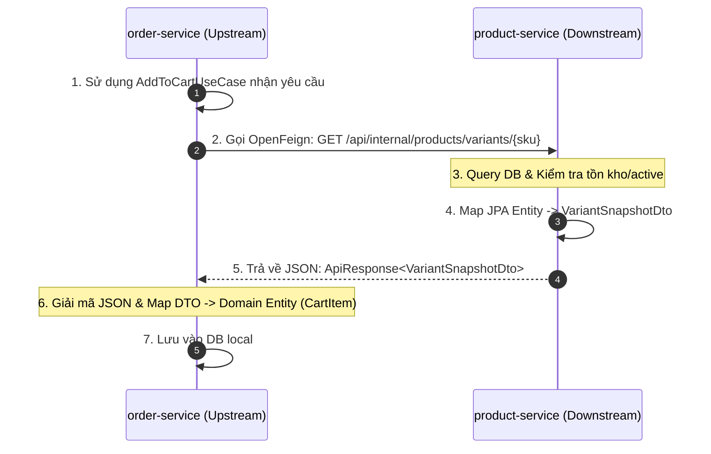

# 📊 Outline Slide Thuyết Trình: Giao Tiếp Giữa order-service & product-service Qua OpenFeign

Tài liệu này đã được tinh chỉnh để tập trung **100% vào giao tiếp liên dịch vụ (Service-to-Service)** giữa `order-service` và `product-service`, bỏ qua các phần bên ngoài như API Gateway hay Xác thực người dùng.

---

## 🖥️ Slide 1: Giới Thiệu Chủ Đề & Đặt Vấn Đề
*   **Tiêu đề**: Phân Tích Giao Tiếp Đồng Bộ Giữa `order-service` và `product-service` qua OpenFeign
*   **Nội dung chính**:
    *   **Ngữ cảnh**: Khi người dùng thêm sản phẩm vào giỏ hàng (`order-service`), hệ thống cần thông tin thời gian thực về tồn kho và giá bán từ `product-service`.
    *   **Thách thức**: Hai dịch vụ chạy độc lập, sở hữu cơ sở dữ liệu riêng biệt.
    *   **Giải pháp**: Thiết lập giao tiếp đồng bộ qua **Spring Cloud OpenFeign**, thống nhất hợp đồng dữ liệu bằng **DTO (Java Record)** và **Generic Response (`ApiResponse<T>`)**.
*   **🗣️ Lời thoại thuyết trình (Presenter Notes)**:
    > *"Kính thưa thầy cô và các bạn, hôm nay nhóm em xin trình bày về cơ chế giao tiếp trực tiếp giữa hai dịch vụ cốt lõi trong hệ thống: **order-service** (quản lý giỏ hàng/đơn hàng) và **product-service** (quản lý sản phẩm/kho hàng). Chúng em sẽ tập trung làm rõ cách dữ liệu được trao đổi qua OpenFeign, cấu trúc DTO, Generic Response và kỹ thuật Mapping Entity-DTO trong luồng nghiệp vụ này."*

---

## 🖥️ Slide 2: Sơ Đồ Giao Tiếp Đơn Giản (Service-to-Service Data Flow)
*   **Tiêu đề**: Luồng Truyền Dữ Liệu Đồng Bộ Giữa 2 Dịch Vụ
*   **Sơ đồ Mermaid**:

*   **🗣️ Lời thoại thuyết trình (Presenter Notes)**:
    > *"Đây là sơ đồ giao tiếp trực tiếp giữa hai dịch vụ. Khi `order-service` thực hiện Use Case thêm vào giỏ, nó sẽ gửi một request HTTP GET qua OpenFeign tới endpoint nội bộ của `product-service`. `product-service` tiếp nhận, kiểm tra dữ liệu dưới database local của nó, đóng gói vào DTO và trả ngược lại. Cuối cùng, `order-service` nhận kết quả, chuyển đổi thành thực thể giỏ hàng local để lưu trữ."*

---

## 🖥️ Slide 3: Định Nghĩa Hợp Đồng Dữ Liệu - DTO (Data Transfer Object)
*   **Tiêu đề**: Java Record - Giải Pháp Cho DTO Bất Biến
*   **Nội dung chính**:
    *   DTO dùng chung giữa 2 dịch vụ để trao đổi snapshot:
    ```java
    public record VariantSnapshotDto(
            UUID productId,
            UUID variantId,
            String sku,
            String productName,
            String primaryImage,
            String size,
            String color,
            BigDecimal price,
            int stock,
            boolean active
    ) {}
    ```
    *   **Ưu điểm**:
        *   Là một **Contract (Hợp đồng dữ liệu)** giúp 2 service hiểu nhau mà không cần chia sẻ mã nguồn lớp thực thể (Entity).
        *   Sử dụng Java Record giúp dữ liệu bất biến (Immutable), tự động sinh các hàm getter/constructor tiện lợi.
*   **🗣️ Lời thoại thuyết trình (Presenter Notes)**:
    > *"Để hai dịch vụ giao tiếp được với nhau, chúng em định nghĩa một DTO dùng chung tên là `VariantSnapshotDto`. DTO này đóng vai trò là một hợp đồng dữ liệu chứa ảnh chụp nhanh các thuộc tính cần thiết như ID, SKU, tên, ảnh, kích cỡ, màu sắc, giá bán, tồn kho và trạng thái mở bán. Việc dùng Java Record giúp DTO này không bị thay đổi trạng thái trong suốt quá trình truyền nhận mạng."*

---

## 🖥️ Slide 4: Cấu Cấu Trúc Phản Hồi Chung (Generic Response Envelope)
*   **Tiêu đề**: Đóng Gói Dữ Liệu Qua Lớp Bao ApiResponse<T>
*   **Nội dung chính**:
    *   Lớp bọc dùng chung [ApiResponse.java](file:///C:/Source/cartzilla/shared/common-web/src/main/java/com/cartzilla/web/response/ApiResponse.java):
    ```java
    public record ApiResponse<T>(
        boolean success, 
        String message, 
        T data,             // Payload động kiểu generic T
        Instant timestamp
    ) {}
    ```
    *   **Nguyên lý hoạt động trong OpenFeign**:
        *   Khai báo phía client:
        ```java
        ApiResponse<VariantSnapshotDto> getVariantBySku(String sku);
        ```
        *   Jackson ObjectMapper tự động giải mã cấu trúc lồng nhau dựa trên kiểu generic `<T>` được định nghĩa.
*   **🗣️ Lời thoại thuyết trình (Presenter Notes)**:
    > *"Tất cả các API giao tiếp nội bộ đều được bọc trong một lớp chung gọi là `ApiResponse<T>`. Lớp này chứa các siêu dữ liệu như cờ trạng thái `success`, thông điệp `message` và trường `data` kiểu generic. Khi `order-service` gọi Feign Client, Jackson sẽ tự động chuyển đổi cấu trúc JSON trong trường `data` thành đúng kiểu Object `VariantSnapshotDto` để sử dụng."*

---

## 🖥️ Slide 5: Khai Báo Đầu Gọi (Upstream - order-service)
*   **Tiêu đề**: Khai Báo OpenFeign Client Tại order-service
*   **Nội dung chính**:
    *   Khai báo interface Feign Client:
    ```java
    // Tại ProductFeignClient.java
    @FeignClient(name = "product-service", configuration = FeignConfig.class)
    public interface ProductFeignClient {
        @GetMapping("/api/internal/products/variants/{sku}")
        ApiResponse<VariantSnapshotDto> getVariantBySku(@PathVariable("sku") String sku);
    }
    ```
    *   **Giải thích**:
        *   `@FeignClient(name = "product-service")`: Chỉ định service đích đăng ký trên Eureka.
        *   `@GetMapping(...)`: Khớp HTTP Method và Path nội bộ của service đích.
*   **🗣️ Lời thoại thuyết trình (Presenter Notes)**:
    > *"Ở phía dịch vụ gọi (Upstream), chúng em khai báo một interface tên là `ProductFeignClient` được gắn annotation `@FeignClient` trỏ tới tên dịch vụ đích là 'product-service'. Nhờ cấu hình này, OpenFeign sẽ tự tìm kiếm địa chỉ thực tế từ Eureka Server để thực hiện cuộc gọi HTTP GET đến endpoint tương ứng."*

---

## 🖥️ Slide 6: Xử Lý Đầu Nhận & Mapping Entity ➔ DTO (Downstream - product-service)
*   **Tiêu đề**: Truy Vấn Entity Và Ánh Xạ Sang DTO Tại product-service
*   **Nội dung chính**:
    *   Controller xử lý yêu cầu:
    ```java
    // Tại InternalProductController.java
    @GetMapping("/variants/{sku}")
    @Transactional(readOnly = true)
    public ApiResponse<VariantSnapshotDto> getVariantBySku(@PathVariable("sku") String sku) {
        ProductVariant v = variantRepository.findBySkuIgnoreCase(sku)
                .orElseThrow(() -> new BusinessException("Variant not found: " + sku));
        var product = v.getProduct();
        String primaryImage = product.getImages().stream()... // Lazy Load Images
        
        return ApiResponse.ok(new VariantSnapshotDto(
                product.getId(), v.getId(), v.getSku(), product.getName(), primaryImage,
                v.getSize(), v.getColor(), v.getPrice(), v.getStock(), product.isActive()));
    }
    ```
    *   **Điểm quan trọng**:
        *   `@Transactional(readOnly = true)`: Giữ Hibernate session mở để truy cập các quan hệ Lazy Load (`product.getImages()`) mà không bị lỗi `LazyInitializationException`.
        *   **Mapping Entity ➔ DTO**: Chuyển đổi từ JPA Entity `ProductVariant` thành DTO an toàn `VariantSnapshotDto`.
*   **🗣️ Lời thoại thuyết trình (Presenter Notes)**:
    > *"Ở phía dịch vụ nhận (Downstream), `product-service` truy vấn thực thể JPA `ProductVariant` từ cơ sở dữ liệu. Do mối quan hệ với bảng ảnh được nạp chậm (Lazy Load), chúng em đặt `@Transactional(readOnly = true)` để giữ session kết nối cơ sở dữ liệu mở khi trích xuất ảnh sản phẩm. Sau đó, chúng em ánh xạ thủ công từ thực thể JPA này sang DTO `VariantSnapshotDto` trước khi phản hồi."*

---

## 🖥️ Slide 7: Nhận Dữ Liệu & Mapping DTO ➔ Domain Entity (Upstream - order-service)
*   **Tiêu đề**: Tiếp Nhận DTO Và Thiết Lập Giỏ Hàng Tại Use Case
*   **Nội dung chính**:
    *   Logic xử lý Use Case:
    ```java
    // Tại AddToCartUseCase.java
    public CartItem execute(UUID userId, String sku, int quantity) {
        // 1. Gọi Feign nhận DTO
        VariantSnapshotDto variant = productFeignClient.getVariantBySku(sku).data();

        // 2. Kiểm tra nghiệp vụ (Tồn kho, Mở bán)
        if (!variant.active()) throw new BusinessException("Sản phẩm ngưng bán");
        if (variant.stock() < quantity) throw new BusinessException("Không đủ tồn kho");

        // 3. Mapping DTO -> Domain Entity (Data Snapshot Pattern)
        CartItem newItem = CartItem.create(
                userId, variant.productId(), variant.sku(), variant.productName(),
                variant.primaryImage(), variant.size(), variant.color(),
                variant.price(), // Lưu snapshot giá tại thời điểm thêm giỏ
                quantity
        );
        return cartItemRepository.save(newItem);
    }
    ```
    *   **Điểm nhấn**: **Data Snapshot Pattern** giúp lưu trực tiếp thông tin tên, giá, ảnh vào DB của `order-service` để tránh gọi HTTP chéo lặp lại ở luồng Xem giỏ hàng, giúp hệ thống chạy rất nhanh.
*   **🗣️ Lời thoại thuyết trình (Presenter Notes)**:
    > *"Khi nhận được DTO kết quả từ Feign, `order-service` tiến hành kiểm tra nghiệp vụ như kho hàng và trạng thái mở bán. Nếu hợp lệ, chúng em map dữ liệu từ DTO sang Domain Entity `CartItem` bằng Factory Method. Điểm đặc biệt ở đây là chúng em lưu trực tiếp các trường giá, tên và ảnh sản phẩm dưới dạng snapshot. Điều này giúp `order-service` có thể tự hiển thị giỏ hàng mà không cần phải tiếp tục gọi sang `product-service` ở những lần sau."*

---

## 🖥️ Slide 8: Xử Lý Ngoại Lệ & Lan Truyền Lỗi (Error Propagation)
*   **Tiêu đề**: Đồng Bộ Hóa Lỗi Nghiệp Vụ Với Feign Error Decoder
*   **Nội dung chính**:
    *   **Thách thức**: Nếu `product-service` báo lỗi (ví dụ: `422 Variant not found`), Feign Client mặc định sẽ ném ra lỗi kết nối mạng HTTP 500 thô thiển.
    *   **Giải pháp**: Tạo bộ giải mã lỗi [FeignErrorDecoder.java](file:///C:/Source/cartzilla/services/order-service/src/main/java/com/cartzilla/order/infrastructure/feign/FeignErrorDecoder.java):
    ```java
    public class FeignErrorDecoder implements ErrorDecoder {
        @Override
        public Exception decode(String methodKey, Response response) {
            String message = null;
            try {
                // Đọc body lỗi JSON và trích xuất trường "message" gốc
                String body = feign.Util.toString(response.body().asReader(StandardCharsets.UTF_8));
                message = objectMapper.readTree(body).get("message").asText();
            } catch (Exception e) {}
            return new BusinessException(message != null ? message : "Lỗi kết nối liên dịch vụ");
        }
    }
    ```
*   **🗣️ Lời thoại thuyết trình (Presenter Notes)**:
    > *"Một vấn đề kinh điển trong giao tiếp Microservices là lan truyền lỗi. Nếu dịch vụ sản phẩm báo lỗi nghiệp vụ, chúng em không muốn client nhận được mã lỗi kết nối 500 thô sơ. Vì vậy, chúng em triển khai lớp `FeignErrorDecoder`. Bộ giải mã lỗi này sẽ chặn phản hồi lỗi từ downstream, trích xuất chính xác thông điệp lỗi nghiệp vụ gốc (ví dụ: không tìm thấy SKU), sau đó đóng gói lại và chuyển tiếp về phía Client một cách rõ ràng."*

---

## 🖥️ Slide 9: Minh Chứng Chạy Demo Thực Tế
*   **Tiêu đề**: Kịch Bản Kiểm Thử Giao Tiếp Liên Dịch Vụ
*   **Nội dung chính**:
    *   **Chạy thành công**: Gọi thêm sản phẩm với SKU `TSN-001-S-WHT`.
        *   `order-service` gửi request qua Feign sang `product-service`.
        *   Nhận về HTTP 200 chứa snapshot sản phẩm.
    *   **Chạy thất bại (Lan truyền lỗi)**: Gọi thêm sản phẩm với SKU giả `SKU-FAKE-999`.
        *   `product-service` ném ngoại lệ lỗi tìm kiếm sản phẩm.
        *   `order-service` bắt được qua `ErrorDecoder` và trả về mã lỗi 422: `"Variant not found: SKU-FAKE-999"`.
*   **🗣️ Lời thoại thuyết trình (Presenter Notes)**:
    > *"Để minh chứng cho cơ chế giao tiếp này hoạt động chuẩn xác, em xin chạy thử hai trường hợp. Trường hợp thứ nhất là thêm một SKU tồn tại hợp lệ trong cơ sở dữ liệu của Product. Hệ thống thực hiện gọi Feign và lưu snapshot thành công. Trường hợp thứ hai, khi thêm một SKU giả, dịch vụ Product báo lỗi, và dịch vụ Order đã trích xuất được thông điệp lỗi này thông qua Error Decoder để gửi trả lại chính xác lỗi cho Client."*

---

## 🖥️ Slide 10: Tổng Kết Bài Học Thiết Kế Kiến Trúc
*   **Tiêu đề**: Ưu Điểm Của Thiết Kế Kiến Trúc Giao Tiếp Trong Cartzilla
*   **Nội dung chính**:
    *   **Tính Đóng Gói (Encapsulation)**: Database-per-service được bảo vệ tuyệt đối.
    *   **Tính Đồng Thuận (Schema Agreement)**: Trao đổi dữ liệu minh bạch qua các DTO phẳng dùng chung.
    *   **Tính Khả Dụng & Hiệu Năng (Performance)**: Áp dụng Snapshot Pattern giúp tối ưu hóa băng thông mạng.
    *   **Tính Nhất Quán Trạng Thái (Error Consistency)**: Đồng bộ hóa và lan truyền mã lỗi nguyên bản.
*   **🗣️ Lời thoại thuyết trình (Presenter Notes)**:
    > *"Tóm lại, mô hình giao tiếp giữa order-service và product-service trong hệ thống Cartzilla đã chứng minh tính đúng đắn của việc tách biệt cơ sở dữ liệu. Nhờ vào OpenFeign, DTO Record, Generic ApiResponse và Feign Error Decoder, chúng em đã xây dựng được một luồng trao đổi dữ liệu vô cùng chặt chẽ, tối ưu hiệu năng và xử lý lỗi đồng bộ. Phần thuyết trình của nhóm em đến đây là kết thúc, xin cảm ơn thầy cô đã lắng nghe!"*
