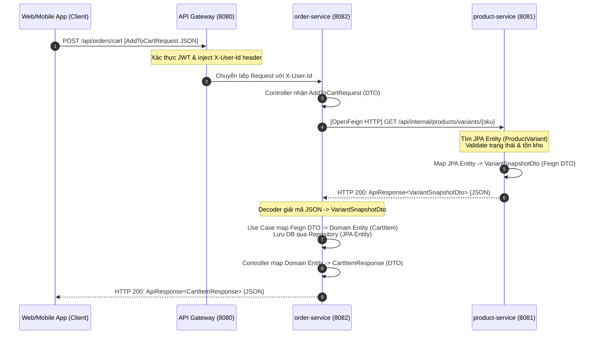

# 🚀 Hướng Dẫn Thuyết Trình & Demo: Trao Đổi Dữ Liệu Qua OpenFeign, DTO & Mapping Entity-DTO

Tài liệu này tập trung làm rõ thiết kế kiến trúc trao đổi dữ liệu giữa các Microservices qua **OpenFeign**, cấu trúc **DTO (Data Transfer Object)**, lớp bọc **Generic Response (`ApiResponse<T>`)**, và cơ chế **Mapping Entity - DTO** trong hệ thống Cartzilla. Đây là tài liệu cốt lõi giúp bạn chuẩn bị tốt nội dung thuyết trình và trả lời các câu hỏi phản biện từ Hội đồng/Giảng viên.

---

## 📐 1. Tổng Quan Kiến Trúc & Luồng Đi Của Dữ Liệu (The Data Journey)

Trong kiến trúc Microservices của Cartzilla, nguyên tắc tối thượng là **Database-per-service** (Mỗi dịch vụ quản lý cơ sở dữ liệu riêng). Dữ liệu trao đổi chéo giữa các service không được truy vấn trực tiếp từ DB mà phải đi qua mạng (HTTP) và được chuyển đổi qua nhiều biểu diễn khác nhau để đảm bảo tính đóng gói (Encapsulation) và giảm thiểu sự liên kết chặt chẽ (Loose Coupling).

### Sơ đồ luồng đi của dữ liệu khi Thêm Sản Phẩm Vào Giỏ Hàng (`AddToCart`):



---

## 📦 2. Thiết Kế & Sử Dụng DTO (Data Transfer Object)

### 2.1 Tại sao cần DTO? Tại sao không dùng trực tiếp JPA Entity?
Hội đồng rất hay hỏi câu này. Dưới đây là 4 lý do chính được áp dụng trong dự án:
1.  **Tránh phụ thuộc vòng & liên kết chặt (Loose Coupling)**: Nếu `order-service` tham chiếu trực tiếp đến thực thể `ProductVariant` của `product-service`, hai service sẽ bị phụ thuộc chéo vào class của nhau. DTO đóng vai trò là một **Contract (Hợp đồng dữ liệu)** độc lập.
2.  **Bảo mật dữ liệu (Data Encapsulation)**: Entity chứa các trường nhạy cảm hoặc không cần thiết (mật khẩu, khóa ngoại phức tạp, trường audit hệ thống). DTO chỉ lọc ra các dữ liệu cần thiết cho client hoặc các service khác.
3.  **Tối ưu hiệu năng mạng (Network Optimization)**: DTO cho phép gộp thông tin từ nhiều bảng hoặc loại bỏ các liên kết lười biếng (Lazy Loading relations) để giảm kích thước payload JSON truyền qua mạng.
4.  **Tránh lỗi tuần hoàn JSON (Circular Reference)**: JPA Entity thường có quan hệ 2 chiều (ví dụ: `Product` chứa nhiều `ProductVariant`, và `ProductVariant` trỏ ngược lại `Product`). Nếu serialize trực tiếp Entity này sang JSON sẽ bị lỗi tràn bộ nhớ (StackOverflow). DTO giải quyết triệt để vấn đề này vì nó là cấu trúc phẳng.

### 2.2 Các loại DTO trong hệ thống Cartzilla
Hệ thống sử dụng **Java Records** (có sẵn từ Java 16+) để định nghĩa DTO. Record giúp DTO bất biến (Immutable), tự động sinh constructor, getter, `equals()`, `hashCode()`, và `toString()`, giúp mã nguồn cực kỳ gọn gàng.

#### A. Client Request DTOs (Nhận dữ liệu từ Client gửi lên)
Định nghĩa tại [CartDtos.java](file:///C:/Source/cartzilla/services/order-service/src/main/java/com/cartzilla/order/api/dto/CartDtos.java):
```java
public record AddToCartRequest(
        @NotBlank String sku,
        @NotNull @Min(1) Integer quantity
) {}
```
*   **Vai trò**: Nhận SKU và số lượng cần mua từ Client. Sử dụng các annotation của Jakarta Validation (`@NotBlank`, `@Min`) để validate định dạng dữ liệu đầu vào ngay tại tầng Controller trước khi đi vào nghiệp vụ.

#### B. Feign Internal DTOs (Trao đổi giữa các Service)
Định nghĩa ở cả hai đầu gửi và nhận để khớp cấu trúc JSON:
*   Đầu nhận ở `order-service`: [ProductFeignClient.java](file:///C:/Source/cartzilla/services/order-service/src/main/java/com/cartzilla/order/infrastructure/feign/ProductFeignClient.java)
*   Đầu gửi ở `product-service`: [InternalProductController.java](file:///C:/Source/cartzilla/services/product-service/src/main/java/com/cartzilla/product/api/controller/InternalProductController.java)

```java
public record VariantSnapshotDto(
        UUID productId,
        UUID variantId,
        String sku,
        String productName,
        String primaryImage,
        String size,
        String color,
        BigDecimal price,
        int stock,
        boolean active
) {}
```
*   **Vai trò**: Đại diện cho **Snapshot (Ảnh chụp nhanh)** của sản phẩm tại thời điểm hiện tại. `order-service` cần các thông tin này để kiểm tra tồn kho (`stock`), kiểm tra mở bán (`active`) và lưu lại thông tin tên/ảnh/giá vào giỏ hàng.

#### C. Client Response DTOs (Trả dữ liệu về cho Client)
Định nghĩa tại [CartDtos.java](file:///C:/Source/cartzilla/services/order-service/src/main/java/com/cartzilla/order/api/dto/CartDtos.java):
```java
public record CartItemResponse(
        UUID id,
        String sku,
        String productName,
        String image,
        String size,
        String color,
        BigDecimal unitPrice,
        int quantity,
        BigDecimal subtotal
) {}
```
*   **Vai trò**: Hiển thị thông tin giỏ hàng cho người dùng. DTO này tính toán thêm trường động `subtotal = unitPrice * quantity` mà không cần lưu trữ cột này trong cơ sở dữ liệu.

---

## ✉️ 3. Chuẩn Hóa Cấu Trúc Response Với Generic Response (`ApiResponse<T>`)

Để các Microservices có tiếng nói chung, toàn bộ hệ thống sử dụng một lớp bao bọc JSON phản hồi duy nhất gọi là **Generic Envelope Response**.

### 3.1 Cấu trúc lớp bọc `ApiResponse<T>`
Định nghĩa tại [ApiResponse.java](file:///C:/Source/cartzilla/shared/common-web/src/main/java/com/cartzilla/web/response/ApiResponse.java) thuộc module shared:

```java
public record ApiResponse<T>(
    boolean success, 
    String message, 
    T data,             // Payload động có kiểu kiểu T
    Instant timestamp
) {
    public static <T> ApiResponse<T> ok(T data) {
        return new ApiResponse<>(true, "OK", data, Instant.now());
    }

    public static <T> ApiResponse<T> error(String message) {
        return new ApiResponse<>(false, message, null, Instant.now());
    }
}
```

*   **Định dạng JSON khi thành công**:
    ```json
    {
      "success": true,
      "message": "OK",
      "data": {
        "sku": "TSN-001-S-WHT",
        "price": 199000.00
      },
      "timestamp": "2026-06-11T03:20:00Z"
    }
    ```
*   **Định dạng JSON khi thất bại**:
    ```json
    {
      "success": false,
      "message": "Sản phẩm không đủ tồn kho",
      "data": null,
      "timestamp": "2026-06-11T03:21:00Z"
    }
    ```

### 3.2 Giải mã kiểu Generic (`T`) trong OpenFeign
Khi định nghĩa Feign Client, chúng ta khai báo kiểu generic cụ thể để Jackson tự động deserialize cấu trúc lồng nhau này:
```java
@GetMapping("/api/internal/products/variants/{sku}")
ApiResponse<VariantSnapshotDto> getVariantBySku(@PathVariable("sku") String sku);
```
Khi `productFeignClient.getVariantBySku(sku)` được gọi:
1.  OpenFeign nhận được chuỗi JSON thô từ `product-service`.
2.  Jackson ObjectMapper phân tích cú pháp và ánh xạ trường `"data"` trong JSON thành object kiểu `VariantSnapshotDto`.
3.  Trong Use Case, chúng ta truy xuất dữ liệu thông qua `.data()`:
    ```java
    VariantSnapshotDto variant = productFeignClient.getVariantBySku(sku).data();
    ```

### 3.3 Cơ chế lan truyền lỗi (Error Propagation)
Khi dịch vụ downstream (`product-service`) trả về lỗi (ví dụ: `422 Unprocessable Entity` do sai SKU hoặc hết kho), Feign Client mặc định sẽ ném ra lỗi chung chung dạng `FeignException: [422] during [GET] ...`.

Để trích xuất thông tin lỗi gốc thân thiện và trả về chính xác cho Client, hệ thống sử dụng **Feign Error Decoder**:

#### Bộ giải mã lỗi: [FeignErrorDecoder.java](file:///C:/Source/cartzilla/services/order-service/src/main/java/com/cartzilla/order/infrastructure/feign/FeignErrorDecoder.java)
```java
public class FeignErrorDecoder implements ErrorDecoder {
    private final ObjectMapper objectMapper = new ObjectMapper();

    @Override
    public Exception decode(String methodKey, Response response) {
        String message = null;
        try {
            if (response.body() != null) {
                // 1. Đọc body JSON lỗi trả về từ product-service
                String body = feign.Util.toString(response.body().asReader(StandardCharsets.UTF_8));
                
                // 2. Parse JSON để lấy trường "message" lỗi nghiệp vụ gốc
                var jsonNode = objectMapper.readTree(body);
                if (jsonNode.has("message")) {
                    message = jsonNode.get("message").asText();
                }
            }
        } catch (Exception e) {
            // Fallback nếu parse lỗi
        }

        // 3. Ném về BusinessException chứa nội dung lỗi gốc
        return new BusinessException(message != null ? message : "Lỗi kết nối giữa các dịch vụ");
    }
}
```

#### Xử lý ngoại lệ tập trung: [GlobalExceptionHandler.java](file:///C:/Source/cartzilla/services/order-service/src/main/java/com/cartzilla/order/api/exception/GlobalExceptionHandler.java)
Ngoại lệ `BusinessException` được ném ra từ `ErrorDecoder` sẽ được bắt bởi Controller Advice của `order-service` và đóng gói vào `ApiResponse.error(ex.getMessage())` để gửi về cho client với mã HTTP tương ứng (ví dụ: 422).

---

## 🔄 4. Kỹ Thuật Mapping Entity - DTO (Hành Trình Dữ Liệu)

Quá trình ánh xạ dữ liệu được thực hiện qua **3 giai đoạn** độc lập nhằm tuân thủ nguyên tắc phân tách trách nhiệm (Separation of Concerns).

```mermaid
graph TD
    subgraph product-service (Downstream)
        A[JPA Entity: ProductVariant] -->|1. Constructor Mapping| B[Feign DTO: VariantSnapshotDto]
    end
    
    subgraph order-service (Upstream)
        B -->|Mạng truyền JSON| C[Feign DTO: VariantSnapshotDto]
        C -->|2. Domain Factory Method| D[Domain Entity: CartItem]
        D -->|Lưu vào DB| E[(Database: cart_items)]
        D -->|3. Static from Method| F[Response DTO: CartItemResponse]
    end
```

### 4.1 Giai đoạn 1: Downstream JPA Entity ➔ Feign DTO
Tại `product-service` Controller ([InternalProductController.java](file:///C:/Source/cartzilla/services/product-service/src/main/java/com/cartzilla/product/api/controller/InternalProductController.java)):

```java
@GetMapping("/variants/{sku}")
@Transactional(readOnly = true)
public ApiResponse<VariantSnapshotDto> getVariantBySku(@PathVariable("sku") String sku) {
    // 1. Lấy Entity từ Database
    ProductVariant v = variantRepository.findBySkuIgnoreCase(sku)
            .orElseThrow(() -> new BusinessException("Variant not found: " + sku));
    
    // 2. Truy xuất các quan hệ Lazy Load một cách an toàn nhờ @Transactional
    var product = v.getProduct();
    String primaryImage = product.getImages().stream()
            .filter(i -> i.isPrimary())
            .map(i -> i.getImageUrl())
            .findFirst()
            .orElse(null);
    
    // 3. Ánh xạ thủ công qua constructor để tạo DTO
    return ApiResponse.ok(new VariantSnapshotDto(
            product.getId(), v.getId(), v.getSku(),
            product.getName(), primaryImage,
            v.getSize(), v.getColor(), v.getPrice(),
            v.getStock(), product.isActive() && !v.isDeleted()));
}
```
> [!IMPORTANT]
> **Giải thích cơ chế Lazy Loading**: Mặc định các danh sách liên kết như `@OneToMany` (ảnh sản phẩm `product.getImages()`) được cấu hình nạp chậm (Lazy Load) để tối ưu hiệu năng. Nếu không có `@Transactional(readOnly = true)` bao quanh hàm Controller này, khi Hibernate đóng session sau khi truy vấn Variant, việc gọi `product.getImages()` để map sang DTO sẽ ném lỗi `LazyInitializationException`. Annotation này giữ session mở trong suốt quá trình mapping.

### 4.2 Giai đoạn 2: Feign DTO ➔ Upstream Domain Entity
Tại `order-service` Use Case ([AddToCartUseCase.java](file:///C:/Source/cartzilla/services/order-service/src/main/java/com/cartzilla/order/application/usecase/AddToCartUseCase.java)):

```java
@Transactional
public CartItem execute(UUID userId, String sku, int quantity) {
    // 1. Gọi Feign nhận DTO
    VariantSnapshotDto variant = productFeignClient.getVariantBySku(sku).data();

    // 2. Validate nghiệp vụ dựa trên DTO
    if (!variant.active()) {
        throw new BusinessException("Sản phẩm không khả dụng: " + sku);
    }
    if (variant.stock() < quantity) {
        throw new BusinessException("Không đủ tồn kho cho SKU: " + sku);
    }

    // 3. Map DTO -> Domain Entity qua Static Factory Method
    CartItem newItem = CartItem.create(
            userId,
            variant.productId(),
            variant.sku(),
            variant.productName(),
            variant.primaryImage(),
            variant.size(),
            variant.color(),
            variant.price(), // CTA-05: Lưu snapshot giá tại thời điểm thêm vào giỏ
            quantity
    );
    
    return cartItemRepository.save(newItem);
}
```
> [!TIP]
> **Lợi ích thiết kế**: Việc sử dụng static factory method `CartItem.create(...)` thay vì set trực tiếp giúp tập trung hóa logic khởi tạo thực thể Domain. Mọi validation ràng buộc dữ liệu (ví dụ: số lượng phải lớn hơn 0, giá không được âm) đều nằm trọn trong hàm khởi tạo này, đảm bảo thực thể `CartItem` luôn ở trạng thái hợp lệ trước khi lưu vào DB.

### 4.3 Giai đoạn 3: Domain Entity ➔ Client Response DTO
Tại `order-service` Response DTO ([CartDtos.java](file:///C:/Source/cartzilla/services/order-service/src/main/java/com/cartzilla/order/api/dto/CartDtos.java)):

```java
public record CartItemResponse(
        UUID id, String sku, String productName,
        String image, String size, String color,
        BigDecimal unitPrice, int quantity, BigDecimal subtotal
) {
    public static CartItemResponse from(CartItem item) {
        return new CartItemResponse(
                item.getId(),
                item.getSku(),
                item.getName(),
                item.getImage(),
                item.getSize(),
                item.getColor(),
                item.getPrice(),
                item.getQuantity(),
                // Tính toán trường phụ thuộc động
                item.getPrice().multiply(BigDecimal.valueOf(item.getQuantity()))
        );
    }
}
```
> [!NOTE]
> **Tại sao không map tự động bằng MapStruct/ModelMapper?**
> Việc tự viết hàm `from(CartItem item)` (Constructor/Manual mapping) giúp mã nguồn hiển thị minh bạch, không phát sinh magic ngầm, biên dịch nhanh và dễ debug. Đồng thời, giảng viên có thể nhìn thấy trực tiếp logic chuyển đổi cấu trúc dữ liệu mà không cần tìm hiểu thêm cấu hình thư viện bên thứ ba.

---

## 🏃‍♂️ 5. Kịch Bản Chạy Demo Thực Tế

Hãy dùng các lệnh cURL sau để trực tiếp chạy thử luồng trao đổi dữ liệu qua API Gateway.

### 🔑 Bước 1: Đăng nhập lấy Token JWT
*   **API**: `POST http://localhost:8080/api/users/login`
*   **Request Body**:
    ```json
    {
      "email": "customer@cartzilla.local",
      "password": "Password123!"
    }
    ```
*   **Hành động**: Lưu lại chuỗi `accessToken` nhận được trong JSON phản hồi.

### 🛒 Bước 2: Xem Giỏ hàng trống ban đầu
*   **API**: `GET http://localhost:8080/api/orders/cart`
*   **Header**: `Authorization: Bearer <mã_token>`
*   **Mô tả**: Dữ liệu trả về sẽ có dạng `ApiResponse<CartResponse>` chứa mảng `items` trống.

### ➕ Bước 3: Thêm sản phẩm hợp lệ (Trigger OpenFeign thành công)
Thêm SKU có thật trong DB của `product-service` (ví dụ: `TSN-001-S-WHT`):
*   **API**: `POST http://localhost:8080/api/orders/cart`
*   **Header**: `Authorization: Bearer <mã_token>`
*   **Request Body**:
    ```json
    {
      "sku": "TSN-001-S-WHT",
      "quantity": 2
    }
    ```
*   **Giải thích thuyết trình**: *"Lúc này, `order-service` sẽ gọi API chéo sang `/api/internal/products/variants/TSN-001-S-WHT` bằng OpenFeign, nhận về `VariantSnapshotDto` chứa giá 199.000 và kho còn 30 sản phẩm. Sau đó, hệ thống lưu và trả về `CartItemResponse` cho Client."*

### ⚠️ Bước 4: Thêm sản phẩm không tồn tại (Trigger Lỗi Downstream & Decoder)
Thêm một SKU không tồn tại trong hệ thống (ví dụ: `SKU-FAKE-999`):
*   **API**: `POST http://localhost:8080/api/orders/cart`
*   **Header**: `Authorization: Bearer <mã_token>`
*   **Request Body**:
    ```json
    {
      "sku": "SKU-FAKE-999",
      "quantity": 1
    }
    ```
*   **JSON lỗi phản hồi mong đợi**:
    ```json
    {
      "success": false,
      "message": "Variant not found: SKU-FAKE-999",
      "data": null,
      "timestamp": "2026-06-11T10:30:15.123Z"
    }
    ```
*   **Giải thích thuyết trình**: *"Khi chúng ta thêm SKU không tồn tại, `product-service` trả về mã lỗi 422 với thông điệp 'Variant not found'. Nhờ có lớp `FeignErrorDecoder` cấu hình trên Feign Client của `order-service`, hệ thống đã trích xuất chính xác thông báo lỗi nghiệp vụ này và đưa vào ngoại lệ `BusinessException` để phản hồi chuẩn hóa về cho client thay vì quăng lỗi sập kết nối 500."*

---

## 💡 6. Bộ Câu Hỏi Phản Biện Thuyết Trình (Q&A)

### Q1: Tại sao trong Feign Client em định nghĩa một DTO record trùng tên với DTO record của bên Target Service? Hai cái này có cần giống hệt nhau không?
*   **Trả lời**: Về bản chất, hai record này nằm ở hai dự án (dịch vụ) khác nhau và độc lập về mặt biên dịch (Compile-time). Tuy nhiên, để Jackson có thể deserialize dữ liệu JSON truyền qua HTTP một cách tự động, cấu trúc các trường (tên trường, kiểu dữ liệu) của hai DTO này bắt buộc phải trùng khớp (hoặc có thể khai báo bỏ qua các trường không cần thiết bằng `@JsonIgnoreProperties`). Đây chính là khái niệm **Schema Agreement (Đồng thuận cấu trúc)** trong giao tiếp Microservices.

### Q2: Nếu hai service khai báo DTO khác nhau một trường thì sao?
*   **Trả lời**: Jackson khi deserialize JSON của Feign Client sẽ ném lỗi `UnrecognizedPropertyException` nếu gặp trường lạ mà DTO nhận không định nghĩa (trừ khi ta cấu hình Jackson bỏ qua thuộc tính không xác định). Do đó, tốt nhất là giữ các DTO giao tiếp nội bộ đồng bộ với nhau. Khi có sự thay đổi cấu trúc, chúng ta cần cập nhật đồng thời cả hai dịch vụ hoặc áp dụng cơ chế versioning API.

### Q3: Em dùng Record của Java cho DTO. Ưu và nhược điểm của Record so với Class truyền thống là gì?
*   **Trả lời**:
    *   **Ưu điểm**: Record cực kỳ ngắn gọn, loại bỏ hoàn toàn mã boilerplate (không cần `@Getter`, `@ToString`, `@EqualsAndHashCode` của Lombok). Hơn nữa, Record mặc định là bất biến (Immutable), giúp dữ liệu DTO truyền đi không bị sửa đổi vô ý trong quá trình chạy chương trình.
    *   **Nhược điểm**: Record không thể kế thừa lớp khác (vì nó đã ngầm kế thừa `java.lang.Record`), chỉ có thể implement interface. Đồng thời, toàn bộ các trường của Record đều là `final` nên không phù hợp nếu cần thay đổi giá trị thuộc tính từng bước (đối với trường hợp đó ta sử dụng Builder pattern).

### Q4: Tại sao em lại lưu snapshot tên, ảnh, giá sản phẩm vào bảng `cart_items` thay vì chỉ lưu `variant_id` rồi join chéo khi lấy giỏ hàng?
*   **Trả lời**: Đây là giải pháp **Data Snapshot (CTA-05)** nhằm giải quyết 2 bài toán lớn trong hệ thống phân tán:
    1.  **Hiệu năng (Performance)**: Khi người dùng xem giỏ hàng, `order-service` chỉ cần thực hiện 1 truy vấn SQL local để lấy toàn bộ thông tin hiển thị (tên, ảnh, giá). Nếu chỉ lưu `variant_id`, mỗi lần xem giỏ hàng chúng ta lại phải gọi HTTP chéo sang `product-service` bằng Feign để lấy thông tin sản phẩm, gây nghẽn cổ chai mạng (Network Latency) và tăng tải cho `product-service`.
    2.  **Tính Nhất Quán Lịch Sử (Business History)**: Giá sản phẩm có thể thay đổi bất kỳ lúc nào. Việc lưu snapshot giúp giữ nguyên mức giá tại thời điểm người dùng chọn mua sản phẩm vào giỏ. Khi thực hiện thanh toán, hệ thống sẽ so sánh snapshot giá này với giá hiện tại để thông báo cho khách hàng nếu có biến động.

### Q5: Tại sao khi cập nhật số lượng giỏ hàng bằng 0 em lại dùng Hard Delete thay vì Soft Delete?
*   **Trả lời**: Giỏ hàng chỉ là dữ liệu tạm thời (Temporary Data), không mang tính pháp lý lịch sử như Đơn hàng (Order) nên việc xóa vĩnh viễn (Hard Delete) giúp làm sạch Database. Quan trọng hơn, bảng `cart_items` có ràng buộc duy nhất (Unique Constraint) trên cặp cột `(user_id, sku)`. Nếu dùng Soft Delete (chỉ đánh dấu `is_deleted = true`), bản ghi cũ vẫn tồn tại trong bảng và sẽ ngăn cản người dùng thêm lại chính SKU đó vào giỏ hàng ở các lần tiếp theo do xung đột Unique key.
