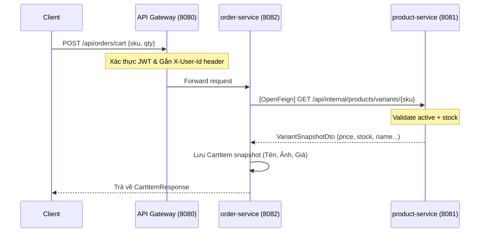

# 🚀 Hướng Dẫn Demo Tính Năng Cart CRUD (OpenFeign & Saga Pattern)

Tài liệu này cung cấp kịch bản chi tiết và hướng dẫn từng bước để thuyết trình/demo tính năng **Giỏ hàng (Cart CRUD)** trước Giảng viên, nêu bật các pattern kiến trúc Microservices đã áp dụng.

---

## 📐 1. Kiến Trúc & Các Pattern Áp Dụng



### Các điểm nhấn kiến trúc cần thuyết minh:
*   **Database-per-service**: `order-service` và `product-service` sở hữu database riêng biệt. Mọi trao đổi dữ liệu đều thông qua API, không truy vấn chéo database.
*   **OpenFeign + Eureka Service Discovery**: `order-service` giao tiếp với `product-service` bằng Feign client thông qua tên dịch vụ đăng ký trên Eureka (`product-service`), không dùng IP/Port cố định.
*   **Data Snapshot (CTA-05)**: Khi lưu sản phẩm vào giỏ, hệ thống chụp lại thông tin chi tiết (tên, ảnh, giá bán) tại thời điểm đó để tối ưu hóa truy vấn và giữ lịch sử giá.
*   **API Gateway Routing & Auth**: Client gọi qua cổng Gateway (`8080`). Gateway xác thực JWT và chuyển tiếp request, đồng thời inject `X-User-Id` header vào các service nội bộ.
*   **Saga Pattern (Chế độ nhất quán cuối cùng)**: Giỏ hàng được tự động dọn sạch (`ClearCart`) sau khi Saga xác nhận đơn hàng đã thanh toán thành công.

---

## 🏃‍♂️ 2. Kịch Bản Demo Từng Bước (Demo Script)

### 🔑 Bước 1: Đăng nhập & Lấy Token xác thực
Gửi request đăng nhập để lấy mã JWT của người dùng test.
*   **API**: `POST http://localhost:8080/api/users/login`
*   **Request Body**:
    ```json
    {
      "email": "customer@cartzilla.local",
      "password": "Password123!"
    }
    ```
*   **Kết quả**: Copy giá trị `accessToken` trong JSON response.
*   **Thuyết minh**: *"Tất cả các API tiếp theo sẽ được gửi qua API Gateway kèm Header `Authorization: Bearer <token>`. Gateway sẽ tự động trích xuất mã này và gửi kèm `X-User-Id` xuống các service con."*

---

### 🛒 Bước 2: Xem Giỏ hàng hiện tại (Trống)
*   **API**: `GET http://localhost:8080/api/orders/cart`
*   **Headers**: 
    *   `Authorization: Bearer <mã_token>`
*   **Kết quả mong đợi**:
    ```json
    {
      "success": true,
      "message": "Success",
      "data": {
        "items": [],
        "total": 0.00
      }
    }
    ```

---

### ➕ Bước 3: Thêm sản phẩm vào giỏ hàng (Gọi OpenFeign)
Thêm sản phẩm có sẵn trong hệ thống (ví dụ SKU: `TSN-001-S-WHT`) với số lượng hợp lệ.
*   **API**: `POST http://localhost:8080/api/orders/cart`
*   **Headers**: 
    *   `Authorization: Bearer <mã_token>`
*   **Request Body**:
    ```json
    {
      "sku": "TSN-001-S-WHT",
      "quantity": 2
    }
    ```
*   **Thuyết minh**: *"Tại bước này, `order-service` sẽ gọi API chéo sang `product-service` thông qua OpenFeign để validate xem TSN-001-S-WHT có tồn tại, active không và còn đủ hàng không. Sau khi xác nhận thành công, nó sẽ lưu thông tin snapshot vào bảng `cart_items`."*

---

### ⚠️ Bước 4: Thêm sản phẩm vượt quá tồn kho (Demo Lỗi Validation)
Thử thêm sản phẩm với số lượng cực lớn vượt quá lượng tồn kho thực tế.
*   **API**: `POST http://localhost:8080/api/orders/cart`
*   **Headers**: 
    *   `Authorization: Bearer <mã_token>`
*   **Request Body**:
    ```json
    {
      "sku": "TSN-001-S-WHT",
      "quantity": 9999
    }
    ```
*   **Kết quả mong đợi**: Mã lỗi `422 Unprocessable Entity` (hoặc lỗi validation trả về từ downstream service):
    ```json
    {
      "success": false,
      "message": "Validation failed calling ProductFeignClient#getVariantBySku(String)"
    }
    ```
*   **Thuyết minh**: *"Hệ thống kiểm tra tồn kho thời gian thực (realtime stock check) thông qua Feign Client để chặn các hành vi thêm số lượng không hợp lệ vào giỏ hàng."*


## 🔍 3. Giải Thích Code OpenFeign Thực Tế

Trong dự án này, OpenFeign đóng vai trò là cầu nối giao tiếp mạng (HTTP) đồng bộ giữa `order-service` và `product-service`. Dưới đây là chi tiết cách triển khai trong mã nguồn thực tế:

### 3.1 Định nghĩa Feign Client Interface
Nằm tại: [ProductFeignClient.java](file:///C:/Source/cartzilla/services/order-service/src/main/java/com/cartzilla/order/infrastructure/feign/ProductFeignClient.java)

```java
@FeignClient(name = "product-service", configuration = FeignConfig.class)
public interface ProductFeignClient {

    @GetMapping("/api/internal/products/variants/{sku}")
    ApiResponse<VariantSnapshotDto> getVariantBySku(@PathVariable("sku") String sku);
}
```
*   **Giải thích**:
    *   `@FeignClient(name = "product-service")`: Khai báo dịch vụ đích. Khi gọi hàm, OpenFeign sẽ tự tìm kiếm trên Eureka danh sách các instance của `product-service` để tự động load-balancing.
    *   `@GetMapping(...)`: Định nghĩa HTTP Method và URL endpoint của service đích.
    *   `@PathVariable("sku")`: Chỉ định truyền sku từ tham số hàm vào Path Variable của URL.

### 3.2 Gọi Feign Client từ Use Case
Nằm tại: [AddToCartUseCase.java](file:///C:/Source/cartzilla/services/order-service/src/main/java/com/cartzilla/order/application/usecase/AddToCartUseCase.java)

```java
@Service
@RequiredArgsConstructor
public class AddToCartUseCase {

    private final CartItemRepository cartItemRepository;
    private final ProductFeignClient productFeignClient; // Inject Feign Client

    @Transactional
    public CartItem execute(UUID userId, String sku, int quantity) {
        // Gọi chéo dịch vụ lấy dữ liệu snapshot sản phẩm thời gian thực
        VariantSnapshotDto variant = productFeignClient
                .getVariantBySku(sku.toUpperCase())
                .data();

        // Thực hiện validate nghiệp vụ dựa trên dữ liệu lấy về
        if (!variant.active()) {
            throw new BusinessException("Sản phẩm không khả dụng: " + sku);
        }
        if (variant.stock() < quantity) {
            throw new BusinessException("Không đủ tồn kho...");
        }
        // ... tiến hành lưu giỏ hàng
    }
}
```
*   **Giải thích**: Use case gọi Feign client giống hệt như gọi một hàm Java local bình thường (`productFeignClient.getVariantBySku(sku)`). Phép thuật của OpenFeign là tự động sinh code proxy dưới nền để thực hiện cuộc gọi HTTP, xử lý serialization/deserialization JSON sang Java DTO (`VariantSnapshotDto`).

### 3.3 Xử lý lỗi tập trung (Feign Error Decoder)
Nằm tại: [FeignErrorDecoder.java](file:///C:/Source/cartzilla/services/order-service/src/main/java/com/cartzilla/order/infrastructure/feign/FeignErrorDecoder.java)

```java
public class FeignErrorDecoder implements ErrorDecoder {
    private final ObjectMapper objectMapper = new ObjectMapper();

    @Override
    public Exception decode(String methodKey, Response response) {
        String message = null;
        try {
            if (response.body() != null) {
                // Đọc body JSON lỗi từ product-service và trích xuất message
                String body = feign.Util.toString(response.body().asReader(StandardCharsets.UTF_8));
                var jsonNode = objectMapper.readTree(body);
                if (jsonNode.has("message")) {
                    message = jsonNode.get("message").asText();
                }
            }
        } catch (Exception e) {}

        // Trả về ngoại lệ nghiệp vụ chung
        return new BusinessException(message != null ? message : "Lỗi gọi dịch vụ");
    }
}
```
*   **Giải thích**: Khi `product-service` trả về mã lỗi HTTP không phải 2xx (ví dụ 422 khi sai SKU), `ErrorDecoder` sẽ chặn lại, tự động phân tích cú pháp (parse) JSON trả về để bóc tách message lỗi nghiệp vụ gốc (ví dụ: *"Variant not found: SKU-999"*), sau đó đóng gói lại thành `BusinessException` để `order-service` ném lỗi chuẩn xác về cho Client.

---

## 💡 4. Các Câu Hỏi Giảng Viên Hay Hỏi (Q&A)

### Q1: Tại sao em dùng OpenFeign để kết nối mà không gọi trực tiếp DB của service khác?
*   **Trả lời**: Trong kiến trúc Microservices, mỗi service phải tự trị và quản lý cơ sở dữ liệu riêng của mình (**Database-per-service**). Việc kết nối trực tiếp vào DB của dịch vụ khác sẽ vi phạm tính đóng gói, gây ra sự phụ thuộc chặt chẽ (Tight Coupling). Nếu cấu trúc bảng của Product thay đổi, Order cũng sẽ bị hỏng. Gọi qua API giúp định nghĩa rõ ràng hợp đồng dữ liệu (Contract) giữa hai bên.

### Q2: Nếu `product-service` gặp sự cố (sập), chức năng Giỏ hàng bị ảnh hưởng thế nào?
*   **Trả lời**: 
    *   Các luồng ghi (`POST` thêm vào giỏ, `PUT` cập nhật số lượng) sẽ tạm thời báo lỗi vì hệ thống không thể kiểm tra trạng thái và tồn kho thực tế của sản phẩm. Điều này là hợp lý để ngăn chặn khách hàng đặt hàng ảo.
    *   Luồng đọc (`GET` xem giỏ hàng) vẫn hoạt động bình thường, vì dữ liệu giỏ hàng đã được lưu trữ sẵn trong DB của `order-service`.

### Q3: Tại sao lại chọn lưu Snapshot (Tên, Ảnh, Giá) của sản phẩm trong giỏ thay vì chỉ lưu `variantId` và join lấy thông tin?
*   **Trả lời**:
    1.  **Hiệu năng**: Giúp API lấy giỏ hàng hoạt động cực kỳ nhanh vì chỉ cần đọc một bảng duy nhất trong DB của `order-service`, không cần thực hiện network call sang `product-service` để lấy thông tin hiển thị.
    2.  **Logic Nghiệp Vụ**: Giữ nguyên thông tin tại thời điểm thêm vào giỏ. Nếu sản phẩm sau đó bị đổi tên hoặc đổi giá, hệ thống vẫn hiển thị đúng thông tin cũ và có thể đưa ra cảnh báo *"Giá sản phẩm đã thay đổi"* trước khi thanh toán.

### Q4: Tại sao trong Cart em lại dùng Hard Delete thay vì Soft Delete như các entity khác?
*   **Trả lời**: Giỏ hàng là trạng thái tạm thời, không cần lưu trữ lịch sử lâu dài như Đơn hàng. Đồng thời, bảng `cart_items` có ràng buộc duy nhất (Unique Constraint) trên cặp cột `(user_id, sku)`. Nếu dùng Soft Delete (chỉ set `is_deleted = true`), bản ghi cũ vẫn nằm trong database và sẽ chặn người dùng thêm lại chính SKU đó vào giỏ hàng ở các lần tiếp theo.

---

## 🧪 5. Kiểm Thử Tự Động (Unit Tests)

Để chứng minh chất lượng mã nguồn và sự an toàn khi chạy các luồng nghiệp vụ giỏ hàng mà không cần phụ thuộc vào mạng hay database thực tế, hệ thống đã được bổ sung 2 lớp kiểm thử tự động (Unit Tests) sử dụng **JUnit 5** và **Mockito**:

1.  **[AddToCartUseCaseTest.java](file:///C:/Source/cartzilla/services/order-service/src/test/java/com/cartzilla/order/application/usecase/AddToCartUseCaseTest.java)**:
    *   `execute_createNewCartItem_success`: Test thêm mới một sản phẩm vào giỏ hàng thành công khi kho còn hàng.
    *   `execute_variantInactive_throwsException`: Test báo lỗi khi sản phẩm ở trạng thái ngưng hoạt động (`active = false`).
    *   `execute_insufficientStock_throwsException`: Test báo lỗi khi yêu cầu số lượng lớn hơn lượng tồn kho thực tế.
    *   `execute_itemAlreadyInCart_aggregatesQuantity_success`: Test cộng dồn số lượng khi thêm sản phẩm đã có sẵn trong giỏ.
2.  **[UpdateCartItemUseCaseTest.java](file:///C:/Source/cartzilla/services/order-service/src/test/java/com/cartzilla/order/application/usecase/UpdateCartItemUseCaseTest.java)**:
    *   `execute_updateToZeroQuantity_deletesItem_returnsNull`: Test tự động xóa sản phẩm khỏi giỏ hàng khi cập nhật số lượng về `0`.
    *   `execute_updateToValidQuantity_success`: Test cập nhật số lượng thành công trong giới hạn tồn kho.
    *   `execute_stockInsufficient_throwsException`: Test chặn cập nhật số lượng khi vượt quá tồn kho mới nhất của sản phẩm.

*Bạn có thể chạy các test case này trực tiếp trên IntelliJ bằng cách click chuột phải vào thư mục test hoặc file test và chọn **Run**.*
