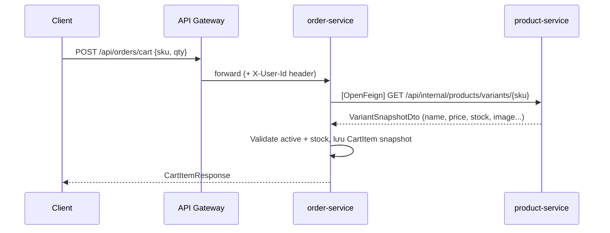
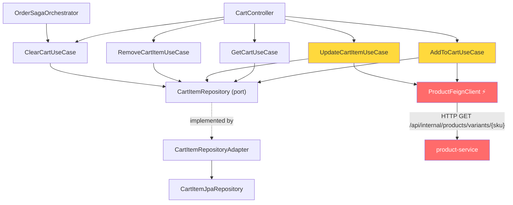

# 🛒 Implementation Plan — Cart CRUD (CHECKLIST 1.3)

> **Mục tiêu**: Implement đầy đủ Cart CRUD cho `order-service`, sử dụng **OpenFeign** gọi sang `product-service` để validate sản phẩm và lấy snapshot.

---

## Tổng quan kiến trúc



---

## Danh sách file cần tạo / sửa

| # | Hành động | File | Lý do |
|---|-----------|------|-------|
| 1 | **TẠO** | `domain/repository/CartItemRepository.java` | Domain port (Hexagonal Architecture) |
| 2 | **TẠO** | `infrastructure/persistence/CartItemJpaRepository.java` | JPA adapter cho Spring Data |
| 3 | **TẠO** | `infrastructure/adapter/CartItemRepositoryAdapter.java` | Adapter nối domain port ↔ JPA |
| 4 | **TẠO** | `api/dto/CartDtos.java` | Request/Response DTOs |
| 5 | **TẠO** | `application/usecase/AddToCartUseCase.java` | **Gọi OpenFeign** + tạo/cộng dồn CartItem |
| 6 | **TẠO** | `application/usecase/GetCartUseCase.java` | Lấy giỏ hàng theo userId |
| 7 | **TẠO** | `application/usecase/UpdateCartItemUseCase.java` | **Gọi OpenFeign** validate stock + cập nhật qty |
| 8 | **TẠO** | `application/usecase/RemoveCartItemUseCase.java` | Xóa 1 item (hard delete) |
| 9 | **TẠO** | `application/usecase/ClearCartUseCase.java` | Xóa toàn bộ cart (hard delete) |
| 10 | **TẠO** | `api/controller/CartController.java` | REST endpoints `/api/orders/cart/**` |
| 11 | **SỬA** | `infrastructure/saga/OrderSagaOrchestrator.java` | Clear cart sau khi checkout/payment success |
| 12 | **KIỂM TRA** | `infra/api-gateway/.../application.yml` | Route `/api/orders/**` đã cover cart |

> Tất cả file Java nằm trong module `services/order-service/src/main/java/com/cartzilla/order/`.

---

## Chi tiết từng file

---

### TASK 1 — Tạo `CartItemRepository.java` (Domain Port)

**File**: `services/order-service/src/main/java/com/cartzilla/order/domain/repository/CartItemRepository.java`

**Tại sao**: Dự án dùng kiến trúc Hexagonal — Use Case chỉ phụ thuộc vào interface trong `domain/`, không import trực tiếp JPA. Tương tự cách [OrderRepository.java](file:///C:/Source/cartzilla/services/order-service/src/main/java/com/cartzilla/order/domain/repository/OrderRepository.java) đã làm.

**Nội dung**:

```java
package com.cartzilla.order.domain.repository;

import com.cartzilla.order.domain.entity.CartItem;

import java.util.List;
import java.util.Optional;
import java.util.UUID;

public interface CartItemRepository {
    CartItem save(CartItem item);
    Optional<CartItem> findByUserIdAndSku(UUID userId, String sku);
    List<CartItem> findByUserId(UUID userId);
    void deleteByUserIdAndSku(UUID userId, String sku);
    void deleteByUserId(UUID userId);
}
```

**Giải thích các method**:
- `save()` — dùng trong Add/Update
- `findByUserIdAndSku()` — kiểm tra SKU đã tồn tại trong giỏ chưa (cộng dồn quantity) + cho Update/Remove
- `findByUserId()` — lấy toàn bộ giỏ hàng
- `deleteByUserIdAndSku()` — xóa 1 item
- `deleteByUserId()` — xóa toàn bộ giỏ (dùng cho ClearCart sau checkout)

---

### TASK 2 — Tạo `CartItemJpaRepository.java` (JPA Interface)

**File**: `services/order-service/src/main/java/com/cartzilla/order/infrastructure/persistence/CartItemJpaRepository.java`

**Tại sao**: Spring Data JPA cần interface extend `JpaRepository` để auto-generate queries. Tương tự [OrderJpaRepository.java](file:///C:/Source/cartzilla/services/order-service/src/main/java/com/cartzilla/order/infrastructure/persistence/OrderJpaRepository.java).

**Nội dung**:

```java
package com.cartzilla.order.infrastructure.persistence;

import com.cartzilla.order.domain.entity.CartItem;
import org.springframework.data.jpa.repository.JpaRepository;

import java.util.List;
import java.util.Optional;
import java.util.UUID;

public interface CartItemJpaRepository extends JpaRepository<CartItem, UUID> {
    Optional<CartItem> findByUserIdAndSku(UUID userId, String sku);
    List<CartItem> findByUserId(UUID userId);
    void deleteByUserIdAndSku(UUID userId, String sku);
    void deleteByUserId(UUID userId);
}
```

> [!NOTE]
> Cart là trạng thái tạm thời, nên thao tác remove/clear dùng **hard delete**. Cách này tránh conflict với unique constraint `(user_id, sku)` khi user xóa item rồi add lại cùng SKU.

---

### TASK 3 — Tạo `CartItemRepositoryAdapter.java` (Adapter)

**File**: `services/order-service/src/main/java/com/cartzilla/order/infrastructure/adapter/CartItemRepositoryAdapter.java`

**Tại sao**: Bridge giữa domain port và JPA. Tương tự pattern của [OrderRepositoryAdapter.java](file:///C:/Source/cartzilla/services/order-service/src/main/java/com/cartzilla/order/infrastructure/adapter/OrderRepositoryAdapter.java). Cart dùng **hard delete** để không đụng unique constraint `(user_id, sku)` khi add lại SKU đã xóa.

**Nội dung**:

```java
package com.cartzilla.order.infrastructure.adapter;

import com.cartzilla.order.domain.entity.CartItem;
import com.cartzilla.order.domain.repository.CartItemRepository;
import com.cartzilla.order.infrastructure.persistence.CartItemJpaRepository;
import lombok.RequiredArgsConstructor;
import org.springframework.stereotype.Component;

import java.util.List;
import java.util.Optional;
import java.util.UUID;

@Component
@RequiredArgsConstructor
public class CartItemRepositoryAdapter implements CartItemRepository {

    private final CartItemJpaRepository jpa;

    @Override
    public CartItem save(CartItem item) {
        return jpa.save(item);
    }

    @Override
    public Optional<CartItem> findByUserIdAndSku(UUID userId, String sku) {
        return jpa.findByUserIdAndSku(userId, sku);
    }

    @Override
    public List<CartItem> findByUserId(UUID userId) {
        return jpa.findByUserId(userId);
    }

    @Override
    public void deleteByUserIdAndSku(UUID userId, String sku) {
        jpa.deleteByUserIdAndSku(userId, sku);
    }

    @Override
    public void deleteByUserId(UUID userId) {
        jpa.deleteByUserId(userId);
    }
}
```

> [!IMPORTANT]
> **Hard-delete cart**: Không gọi `item.softDelete()` cho cart. Nếu chỉ set `is_deleted = true`, record cũ vẫn giữ unique `(user_id, sku)` và user sẽ không add lại được cùng SKU sau khi xóa.

---

### TASK 4 — Tạo `CartDtos.java` (Request/Response DTOs)

**File**: `services/order-service/src/main/java/com/cartzilla/order/api/dto/CartDtos.java`

**Tại sao**: Tách biệt request/response khỏi domain entity — đúng pattern DTO của dự án (xem [ProductDtos.java](file:///C:/Source/cartzilla/services/product-service/src/main/java/com/cartzilla/product/api/dto/ProductDtos.java) làm mẫu).

**Nội dung**:

```java
package com.cartzilla.order.api.dto;

import com.cartzilla.order.domain.entity.CartItem;
import jakarta.validation.constraints.Min;
import jakarta.validation.constraints.NotBlank;
import jakarta.validation.constraints.NotNull;

import java.math.BigDecimal;
import java.util.List;
import java.util.UUID;

public class CartDtos {
    private CartDtos() {}

    // ─── Requests ──────────────────────────────────────────────────────────

    /** POST /api/orders/cart — body */
    public record AddToCartRequest(
            @NotBlank String sku,
            @NotNull @Min(1) Integer quantity
    ) {}

    /** PUT /api/orders/cart/{sku} — body */
    public record UpdateCartItemRequest(
            @NotNull @Min(0) Integer quantity   // quantity = 0 → xóa item
    ) {}

    // ─── Responses ─────────────────────────────────────────────────────────

    public record CartItemResponse(
            UUID id,
            String sku,
            String productName,
            String image,
            String size,
            String color,
            BigDecimal unitPrice,
            int quantity,
            BigDecimal subtotal
    ) {
        /** Map từ domain entity sang DTO */
        public static CartItemResponse from(CartItem item) {
            return new CartItemResponse(
                    item.getId(),
                    item.getSku(),
                    item.getName(),
                    item.getImage(),
                    item.getSize(),
                    item.getColor(),
                    item.getPrice(),
                    item.getQuantity(),
                    item.getPrice().multiply(BigDecimal.valueOf(item.getQuantity()))
            );
        }
    }

    public record CartResponse(
            List<CartItemResponse> items,
            BigDecimal total
    ) {
        /** Tính tổng từ danh sách CartItem entity */
        public static CartResponse from(List<CartItem> items) {
            List<CartItemResponse> dtos = items.stream()
                    .map(CartItemResponse::from)
                    .toList();
            BigDecimal total = dtos.stream()
                    .map(CartItemResponse::subtotal)
                    .reduce(BigDecimal.ZERO, BigDecimal::add);
            return new CartResponse(dtos, total);
        }
    }
}
```

---

### TASK 5 — Tạo `AddToCartUseCase.java` ⭐ (OpenFeign chính)

**File**: `services/order-service/src/main/java/com/cartzilla/order/application/usecase/AddToCartUseCase.java`

**Tại sao**: Đây là **use case quan trọng nhất** cho demo OpenFeign. Khi user thêm sản phẩm vào giỏ, cần gọi `product-service` qua [ProductFeignClient.getVariantBySku()](file:///C:/Source/cartzilla/services/order-service/src/main/java/com/cartzilla/order/infrastructure/feign/ProductFeignClient.java#L27-L28) để:
1. Kiểm tra variant có `active = true` không (CTA-03)
2. Kiểm tra `stock >= quantity` (X-01)
3. Lấy snapshot (productName, image, size, color, price) lưu vào CartItem (CTA-05)

**Nội dung**:

```java
package com.cartzilla.order.application.usecase;

import com.cartzilla.order.domain.entity.CartItem;
import com.cartzilla.order.domain.repository.CartItemRepository;
import com.cartzilla.order.infrastructure.feign.ProductFeignClient;
import com.cartzilla.order.infrastructure.feign.ProductFeignClient.VariantSnapshotDto;
import com.cartzilla.web.exception.BusinessException;
import lombok.RequiredArgsConstructor;
import org.springframework.stereotype.Service;
import org.springframework.transaction.annotation.Transactional;

import java.util.Optional;
import java.util.UUID;

@Service
@RequiredArgsConstructor
public class AddToCartUseCase {

    private final CartItemRepository cartItemRepository;
    private final ProductFeignClient productFeignClient;   // ← OpenFeign

    @Transactional
    public CartItem execute(UUID userId, String sku, int quantity) {

        // ① Gọi product-service qua OpenFeign lấy variant snapshot
        VariantSnapshotDto variant = productFeignClient
                .getVariantBySku(sku.toUpperCase())
                .data();

        // ② Validate: variant phải active (CTA-03)
        if (!variant.active()) {
            throw new BusinessException("Sản phẩm không khả dụng: " + sku);
        }

        // ③ Validate: tồn kho đủ (X-01)
        if (variant.stock() < quantity) {
            throw new BusinessException(
                    "Không đủ tồn kho cho SKU " + sku +
                    " (còn: " + variant.stock() + ", yêu cầu: " + quantity + ")");
        }

        // ④ Kiểm tra đã có trong giỏ chưa → cộng dồn quantity (CTA-01)
        Optional<CartItem> existing = cartItemRepository
                .findByUserIdAndSku(userId, sku.toUpperCase());

        if (existing.isPresent()) {
            CartItem item = existing.get();
            // Validate tổng quantity mới vẫn <= stock
            int newTotal = item.getQuantity() + quantity;
            if (variant.stock() < newTotal) {
                throw new BusinessException(
                        "Tổng số lượng vượt tồn kho (đang có: " +
                        item.getQuantity() + ", thêm: " + quantity +
                        ", kho: " + variant.stock() + ")");
            }
            item.addQuantity(quantity);
            // Cập nhật lại snapshot price (giá có thể thay đổi) — CTA-05
            item.refreshPrice(variant.price());
            return cartItemRepository.save(item);
        }

        // ⑤ Tạo mới CartItem với snapshot từ product-service
        CartItem newItem = CartItem.create(
                userId,
                variant.productId(),
                variant.sku(),
                variant.productName(),
                variant.primaryImage(),
                variant.size(),
                variant.color(),
                variant.price(),
                quantity
        );
        return cartItemRepository.save(newItem);
    }
}
```

> [!IMPORTANT]
> **Điểm demo OpenFeign**: Dòng `productFeignClient.getVariantBySku(sku)` sẽ thực hiện HTTP GET tới `product-service` (`http://product-service/api/internal/products/variants/{sku}`) thông qua Eureka discovery + load balancer. Đây là nơi cross-service communication xảy ra.

---

### TASK 6 — Tạo `GetCartUseCase.java`

**File**: `services/order-service/src/main/java/com/cartzilla/order/application/usecase/GetCartUseCase.java`

**Tại sao**: Đơn giản nhất — chỉ query DB, không gọi Feign. Nhưng cần thiết để demo GET endpoint.

**Nội dung**:

```java
package com.cartzilla.order.application.usecase;

import com.cartzilla.order.domain.entity.CartItem;
import com.cartzilla.order.domain.repository.CartItemRepository;
import lombok.RequiredArgsConstructor;
import org.springframework.stereotype.Service;
import org.springframework.transaction.annotation.Transactional;

import java.util.List;
import java.util.UUID;

@Service
@RequiredArgsConstructor
public class GetCartUseCase {

    private final CartItemRepository cartItemRepository;

    @Transactional(readOnly = true)
    public List<CartItem> execute(UUID userId) {
        return cartItemRepository.findByUserId(userId);
    }
}
```

---

### TASK 7 — Tạo `UpdateCartItemUseCase.java` ⭐ (OpenFeign phụ)

**File**: `services/order-service/src/main/java/com/cartzilla/order/application/usecase/UpdateCartItemUseCase.java`

**Tại sao**: Khi user thay đổi quantity, cần gọi lại `product-service` qua OpenFeign để validate stock mới nhất. Nếu `quantity = 0` thì hard-delete item (CTA-02).

**Nội dung**:

```java
package com.cartzilla.order.application.usecase;

import com.cartzilla.order.domain.entity.CartItem;
import com.cartzilla.order.domain.repository.CartItemRepository;
import com.cartzilla.order.infrastructure.feign.ProductFeignClient;
import com.cartzilla.order.infrastructure.feign.ProductFeignClient.VariantSnapshotDto;
import com.cartzilla.web.exception.BusinessException;
import lombok.RequiredArgsConstructor;
import org.springframework.stereotype.Service;
import org.springframework.transaction.annotation.Transactional;

import java.util.UUID;

@Service
@RequiredArgsConstructor
public class UpdateCartItemUseCase {

    private final CartItemRepository cartItemRepository;
    private final ProductFeignClient productFeignClient;   // ← OpenFeign

    @Transactional
    public CartItem execute(UUID userId, String sku, int newQuantity) {

        CartItem item = cartItemRepository.findByUserIdAndSku(userId, sku.toUpperCase())
                .orElseThrow(() -> new BusinessException("Cart item not found: " + sku));

        // quantity = 0 → hard-delete (CTA-02)
        if (newQuantity == 0) {
            cartItemRepository.deleteByUserIdAndSku(userId, sku.toUpperCase());
            return null;
        }

        // Gọi product-service validate stock mới nhất
        VariantSnapshotDto variant = productFeignClient
                .getVariantBySku(sku.toUpperCase())
                .data();

        if (!variant.active()) {
            throw new BusinessException("Sản phẩm không còn khả dụng: " + sku);
        }
        if (variant.stock() < newQuantity) {
            throw new BusinessException(
                    "Không đủ tồn kho (còn: " + variant.stock() +
                    ", yêu cầu: " + newQuantity + ")");
        }

        item.updateQuantity(newQuantity);
        item.refreshPrice(variant.price());   // refresh snapshot price
        return cartItemRepository.save(item);
    }
}
```

---

### TASK 8 — Tạo `RemoveCartItemUseCase.java`

**File**: `services/order-service/src/main/java/com/cartzilla/order/application/usecase/RemoveCartItemUseCase.java`

**Tại sao**: Xóa 1 item khỏi giỏ — không gọi Feign, hard delete trực tiếp trong DB.

**Nội dung**:

```java
package com.cartzilla.order.application.usecase;

import com.cartzilla.order.domain.repository.CartItemRepository;
import lombok.RequiredArgsConstructor;
import org.springframework.stereotype.Service;
import org.springframework.transaction.annotation.Transactional;

import java.util.UUID;

@Service
@RequiredArgsConstructor
public class RemoveCartItemUseCase {

    private final CartItemRepository cartItemRepository;

    @Transactional
    public void execute(UUID userId, String sku) {
        cartItemRepository.deleteByUserIdAndSku(userId, sku.toUpperCase());
    }
}
```

---

### TASK 9 — Tạo `ClearCartUseCase.java`

**File**: `services/order-service/src/main/java/com/cartzilla/order/application/usecase/ClearCartUseCase.java`

**Tại sao**: Xóa toàn bộ cart của user. Dùng cho endpoint `DELETE /api/orders/cart` và gọi sau khi checkout/payment success.

**Nội dung**:

```java
package com.cartzilla.order.application.usecase;

import com.cartzilla.order.domain.repository.CartItemRepository;
import lombok.RequiredArgsConstructor;
import org.springframework.stereotype.Service;
import org.springframework.transaction.annotation.Transactional;

import java.util.UUID;

@Service
@RequiredArgsConstructor
public class ClearCartUseCase {

    private final CartItemRepository cartItemRepository;

    @Transactional
    public void execute(UUID userId) {
        cartItemRepository.deleteByUserId(userId);
    }
}
```

---

### TASK 10 — Tạo `CartController.java` (REST API)

**File**: `services/order-service/src/main/java/com/cartzilla/order/api/controller/CartController.java`

**Tại sao**: Expose các REST endpoints cho client gọi. Follow cùng pattern như [OrderController.java](file:///C:/Source/cartzilla/services/order-service/src/main/java/com/cartzilla/order/api/controller/OrderController.java). Sử dụng `@RequestHeader("X-User-Id")` để lấy userId (được inject bởi [JwtAuthFilter](file:///C:/Source/cartzilla/infra/api-gateway/src/main/java/com/cartzilla/gateway/filter/JwtAuthFilter.java) ở API Gateway).

**Nội dung**:

```java
package com.cartzilla.order.api.controller;

import com.cartzilla.order.api.dto.CartDtos.AddToCartRequest;
import com.cartzilla.order.api.dto.CartDtos.CartItemResponse;
import com.cartzilla.order.api.dto.CartDtos.CartResponse;
import com.cartzilla.order.api.dto.CartDtos.UpdateCartItemRequest;
import com.cartzilla.order.application.usecase.AddToCartUseCase;
import com.cartzilla.order.application.usecase.ClearCartUseCase;
import com.cartzilla.order.application.usecase.GetCartUseCase;
import com.cartzilla.order.application.usecase.RemoveCartItemUseCase;
import com.cartzilla.order.application.usecase.UpdateCartItemUseCase;
import com.cartzilla.order.domain.entity.CartItem;
import com.cartzilla.web.response.ApiResponse;
import jakarta.validation.Valid;
import lombok.RequiredArgsConstructor;
import org.springframework.web.bind.annotation.DeleteMapping;
import org.springframework.web.bind.annotation.GetMapping;
import org.springframework.web.bind.annotation.PathVariable;
import org.springframework.web.bind.annotation.PostMapping;
import org.springframework.web.bind.annotation.PutMapping;
import org.springframework.web.bind.annotation.RequestBody;
import org.springframework.web.bind.annotation.RequestHeader;
import org.springframework.web.bind.annotation.RequestMapping;
import org.springframework.web.bind.annotation.RestController;

import java.util.UUID;

@RestController
@RequestMapping("/api/orders/cart")
@RequiredArgsConstructor
public class CartController {

    private final AddToCartUseCase addToCartUseCase;
    private final GetCartUseCase getCartUseCase;
    private final UpdateCartItemUseCase updateCartItemUseCase;
    private final RemoveCartItemUseCase removeCartItemUseCase;
    private final ClearCartUseCase clearCartUseCase;

    /** POST /api/orders/cart — thêm sản phẩm vào giỏ */
    @PostMapping
    public ApiResponse<CartItemResponse> addToCart(
            @RequestHeader("X-User-Id") UUID userId,
            @Valid @RequestBody AddToCartRequest request) {

        CartItem item = addToCartUseCase.execute(
                userId, request.sku(), request.quantity());
        return ApiResponse.ok("Đã thêm vào giỏ hàng", CartItemResponse.from(item));
    }

    /** GET /api/orders/cart — xem giỏ hàng */
    @GetMapping
    public ApiResponse<CartResponse> getCart(
            @RequestHeader("X-User-Id") UUID userId) {

        var items = getCartUseCase.execute(userId);
        return ApiResponse.ok(CartResponse.from(items));
    }

    /** PUT /api/orders/cart/{sku} — cập nhật số lượng */
    @PutMapping("/{sku}")
    public ApiResponse<CartItemResponse> updateCartItem(
            @RequestHeader("X-User-Id") UUID userId,
            @PathVariable String sku,
            @Valid @RequestBody UpdateCartItemRequest request) {

        CartItem item = updateCartItemUseCase.execute(
                userId, sku, request.quantity());
        if (item == null) {
            return ApiResponse.ok("Đã xóa khỏi giỏ hàng", null);
        }
        return ApiResponse.ok("Đã cập nhật giỏ hàng", CartItemResponse.from(item));
    }

    /** DELETE /api/orders/cart/{sku} — xóa 1 item */
    @DeleteMapping("/{sku}")
    public ApiResponse<Void> removeCartItem(
            @RequestHeader("X-User-Id") UUID userId,
            @PathVariable String sku) {

        removeCartItemUseCase.execute(userId, sku);
        return ApiResponse.ok("Đã xóa khỏi giỏ hàng", null);
    }

    /** DELETE /api/orders/cart — xóa toàn bộ giỏ hàng */
    @DeleteMapping
    public ApiResponse<Void> clearCart(
            @RequestHeader("X-User-Id") UUID userId) {

        clearCartUseCase.execute(userId);
        return ApiResponse.ok("Đã xóa toàn bộ giỏ hàng", null);
    }
}
```

> [!NOTE]
> **Routing**: URL pattern `/api/orders/cart/**` đã được cover bởi gateway route hiện tại `Path=/api/orders/**` (xem Task 12). Không cần thêm route mới.

---

### TASK 11 — Tích hợp clear cart sau checkout success

**File**: `services/order-service/src/main/java/com/cartzilla/order/infrastructure/saga/OrderSagaOrchestrator.java`

**Tại sao**: Checklist yêu cầu sau khi saga hoàn tất thành công thì xóa cart của user. Vì checkout hiện được confirm trong `onPaymentResult()` khi payment success, đây là điểm đúng để gọi `ClearCartUseCase`.

**Nội dung cần sửa**:

```java
import com.cartzilla.order.application.usecase.ClearCartUseCase;

// ...

private final ClearCartUseCase clearCartUseCase;

// ...

order.confirm(null);
orderRepository.save(order);
clearCartUseCase.execute(order.getUserId());
saga.complete();
```

> [!NOTE]
> Gọi clear cart sau khi `orderRepository.save(order)` thành công. Nếu muốn transaction rollback đồng bộ khi clear cart lỗi, giữ nguyên trong cùng `@Transactional` như hiện tại.

---

### TASK 12 — Kiểm tra API Gateway routing (KHÔNG cần sửa)

**File**: [application.yml](file:///C:/Source/cartzilla/infra/api-gateway/src/main/resources/application.yml)

**Kết luận**: **KHÔNG CẦN SỬA**. Route hiện tại của `order-service` đã là:
```yaml
- id: order-service
  uri: lb://ORDER-SERVICE
  predicates:
    - Path=/api/orders/**,/api/staff/orders/**
  filters:
    - JwtAuth
```

Pattern `/api/orders/**` đã match cả `/api/orders/cart`, `/api/orders/cart/{sku}`. Gateway sẽ tự động forward request tới `order-service` và inject `X-User-Id` header qua `JwtAuth` filter.

---

## Luồng demo từ đầu đến cuối

### Prerequisite
Đảm bảo các service đã chạy:
- ✅ `postgres-order` (Docker)
- ✅ `product-service` (IntelliJ)
- ✅ `order-service` (IntelliJ)
- ✅ `eureka-server` (IntelliJ)
- ✅ `api-gateway` (IntelliJ)

### Demo Steps (Postman / cURL)

```
── BƯỚC 1: Thêm sản phẩm vào giỏ ──────────────────────────────────
POST http://localhost:8080/api/orders/cart
Headers:
  Authorization: Bearer <jwt_token>
Body:
  { "sku": "SKU-001", "quantity": 2 }

→ order-service GỌI OpenFeign → product-service
→ Lấy snapshot variant (name, price, image, stock)
→ Validate active + stock
→ Lưu CartItem → Response

── BƯỚC 2: Xem giỏ hàng ────────────────────────────────────────────
GET http://localhost:8080/api/orders/cart
Headers:
  Authorization: Bearer <jwt_token>

→ Trả về danh sách items + tổng tiền

── BƯỚC 3: Cập nhật số lượng ────────────────────────────────────────
PUT http://localhost:8080/api/orders/cart/SKU-001
Headers:
  Authorization: Bearer <jwt_token>
Body:
  { "quantity": 5 }

→ order-service GỌI OpenFeign → product-service (validate stock)
→ Update quantity + refresh price snapshot

── BƯỚC 4: Xóa item ────────────────────────────────────────────────
DELETE http://localhost:8080/api/orders/cart/SKU-001
Headers:
  Authorization: Bearer <jwt_token>

→ Hard-delete cart item

── BƯỚC 5: Xóa toàn bộ giỏ ─────────────────────────────────────────
DELETE http://localhost:8080/api/orders/cart
Headers:
  Authorization: Bearer <jwt_token>

→ Hard-delete toàn bộ cart của user
```

---

## Cây thư mục sau khi implement

```
services/order-service/src/main/java/com/cartzilla/order/
├── api/
│   ├── controller/
│   │   ├── OrderController.java          (có sẵn)
│   │   └── CartController.java           ← TẠO MỚI (Task 10)
│   └── dto/
│       └── CartDtos.java                 ← TẠO MỚI (Task 4)
├── application/
│   ├── command/
│   │   └── OrderCommand.java             (có sẵn)
│   └── usecase/
│       ├── CheckoutUseCase.java           (có sẵn)
│       ├── AddToCartUseCase.java          ← TẠO MỚI (Task 5) ⭐ OpenFeign
│       ├── GetCartUseCase.java            ← TẠO MỚI (Task 6)
│       ├── UpdateCartItemUseCase.java     ← TẠO MỚI (Task 7) ⭐ OpenFeign
│       ├── RemoveCartItemUseCase.java     ← TẠO MỚI (Task 8)
│       └── ClearCartUseCase.java          ← TẠO MỚI (Task 9)
├── domain/
│   ├── entity/
│   │   ├── CartItem.java                  (có sẵn ✅)
│   │   └── ...
│   └── repository/
│       ├── OrderRepository.java           (có sẵn)
│       ├── SagaStateRepository.java       (có sẵn)
│       └── CartItemRepository.java        ← TẠO MỚI (Task 1)
└── infrastructure/
    ├── adapter/
    │   ├── OrderRepositoryAdapter.java    (có sẵn)
    │   └── CartItemRepositoryAdapter.java ← TẠO MỚI (Task 3)
    ├── feign/
    │   ├── ProductFeignClient.java        (có sẵn ✅ — dùng getVariantBySku)
    │   ├── UserFeignClient.java           (có sẵn)
    │   ├── FeignConfig.java               (có sẵn ✅)
    │   └── FeignErrorDecoder.java         (có sẵn ✅)
    └── persistence/
        ├── OrderJpaRepository.java        (có sẵn)
        ├── SagaStateJpaRepository.java    (có sẵn)
        └── CartItemJpaRepository.java     ← TẠO MỚI (Task 2)
```

---

## Dependency Map



---

## Thứ tự implement khuyến nghị

| Thứ tự | Task | Phụ thuộc vào |
|--------|------|---------------|
| 1 | Task 1: `CartItemRepository` (port) | Không |
| 2 | Task 2: `CartItemJpaRepository` (JPA) | Không |
| 3 | Task 3: `CartItemRepositoryAdapter` | Task 1 + Task 2 |
| 4 | Task 4: `CartDtos` | Không |
| 5 | Task 5: `AddToCartUseCase` ⭐ | Task 1 + ProductFeignClient (có sẵn) |
| 6 | Task 6: `GetCartUseCase` | Task 1 |
| 7 | Task 7: `UpdateCartItemUseCase` ⭐ | Task 1 + ProductFeignClient (có sẵn) |
| 8 | Task 8: `RemoveCartItemUseCase` | Task 1 |
| 9 | Task 9: `ClearCartUseCase` | Task 1 |
| 10 | Task 10: `CartController` | Task 4 + Task 5-9 |
| 11 | Task 11: `OrderSagaOrchestrator` clear cart | Task 9 |
| 12 | Task 12: kiểm tra gateway route | Không |

> [!TIP]
> Có thể implement **Task 1→2→3** cùng lúc (infra layer), rồi **Task 4→5→6→7→8→9** cùng lúc (application layer), cuối cùng **Task 10→11** (api + saga integration).
