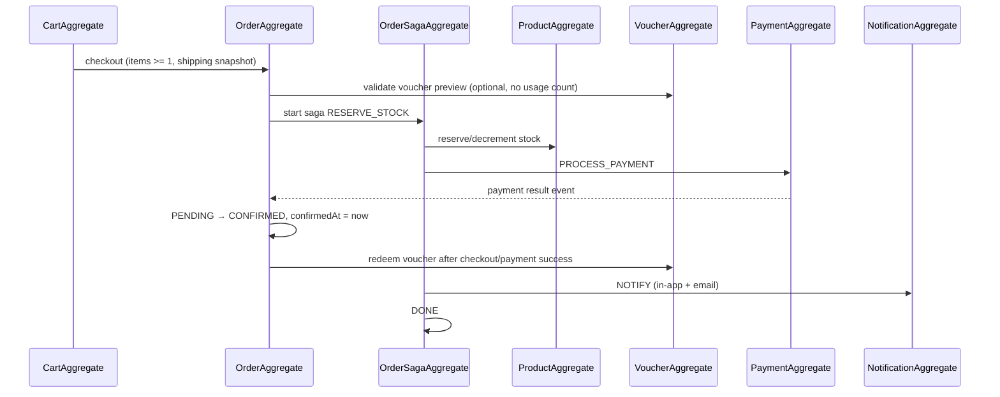

# Domain Model — Cartzilla Microservices

> **Nguồn:** [`DBDesign_Cartzilla.md`](./DBDesign_Cartzilla.md) v2.2  
> **Mục đích:** Liệt kê Entity, Value Object (VO), Aggregate Root theo từng service và định nghĩa **invariant / business rule** cho từng lớp domain.  
> **Quy ước:** Mọi entity kế thừa `BaseEntity` → có `createdAt`, `updatedAt`, `createdBy`, `updatedBy`, `isDeleted`, `deletedAt`. Soft delete qua `is_deleted = false`.

---

## Tổng quan theo service

| Service | Database | Aggregate Roots | Entities | Value Objects |
|---------|----------|-----------------|----------|---------------|
| user-service | cartzilla_user_db | `UserAggregate`, `VoucherAggregate` | User, Address, RefreshToken, OAuthAccount, Voucher, VoucherUsage, VoucherAllowedUser | Email, Phone, Role, PasswordHash, OAuthProvider, DiscountType, VoucherAudienceType, Money |
| product-service | cartzilla_product_db | `ProductAggregate`, `CategoryAggregate`, `VendorAggregate` | Product, Category, Vendor, ProductVariant, ProductImage | Money, Slug, Sku, VendorType, ColorHex |
| order-service | cartzilla_order_db | `CartAggregate`, `OrderAggregate`, `OrderSagaAggregate` | CartItem, Order, OrderItem, OrderStatusLog, SagaState | ShippingAddress, OrderStatus, PaymentMethod, PaymentStatus, Money |
| payment-service | cartzilla_pay_db | `PaymentAggregate` | Payment, PaymentTransaction | PaymentMethod, PaymentStatus, TransactionType, Money, Currency |
| notification-service | cartzilla_notif_db | `NotificationAggregate` | Notification, EmailLog | NotificationType, NotificationStatus, NotificationPriority, EmailStatus |

---

## Quy tắc chung (Cross-cutting)

| ID | Rule | Áp dụng |
|----|------|---------|
| **BR-G01** | `createdAt` được set một lần khi tạo, **không được sửa** sau đó (`updatable = false`). | Mọi entity |
| **BR-G02** | `updatedAt` ≥ `createdAt` tại mọi thời điểm. | Mọi entity |
| **BR-G03** | Khi soft delete: `isDeleted = true`, `deletedAt` phải được set; `deletedAt` ≥ `createdAt`. | Mọi entity |
| **BR-G04** | Không JOIN / FK cross-database; tham chiếu liên service chỉ lưu UUID + snapshot tại thời điểm nghiệp vụ. | order, payment, notification, voucher_usages |
| **BR-G05** | Số tiền (`Money`) luôn ≥ 0, scale 2 chữ số thập phân, currency mặc định `VND`. | product, order, payment |
| **BR-G06** | Thời gian nghiệp vụ (`confirmedAt`, `paidAt`, `expiresAt`, `readAt`, `sentAt`, …) **không được trước** `createdAt` của cùng record. | Mọi entity có timestamp nghiệp vụ |

---

## 1. user-service (`cartzilla_user_db`)

### 1.1 Aggregate Roots

#### `UserAggregate`

**Thành phần:** `User` (root) + `List<Address>` + (tham chiếu) `List<RefreshToken>`, `List<OAuthAccount>`

| ID | Invariant / Rule |
|----|------------------|
| **UA-01** | Mỗi `User` phải có **ít nhất một cách đăng nhập**: `passwordHash` **hoặc** ≥ 1 `OAuthAccount` liên kết. |
| **UA-02** | `email` unique trong toàn hệ thống (kể cả soft-deleted nếu unique index không filter — nên dùng partial unique `WHERE is_deleted = false`). |
| **UA-03** | User mới mặc định: `role = CUSTOMER`, `emailVerified = false`, `isActive = true`. |
| **UA-04** | Chỉ user `isActive = true` mới được tạo order / dùng voucher / nhận refresh token mới. |
| **UA-05** | Khi thêm/sửa `Address.isDefault = true` → **tất cả address khác** của cùng user phải set `isDefault = false` (chỉ **một** địa chỉ mặc định). |
| **UA-06** | User phải có ≥ 1 `Address` hợp lệ trước khi checkout (rule ở order-service, validate qua API user-service). |
| **UA-07** | Không hard-delete user có lịch sử order — chỉ soft delete; cross-service check qua order-service API. |
| **UA-08** | `STAFF` / `ADMIN` không được tự hạ role xuống `CUSTOMER` nếu còn là admin duy nhất (rule ứng dụng). |

#### `VoucherAggregate`

**Thành phần:** `Voucher` (root) + `List<VoucherUsage>` + `List<VoucherAllowedUser>`

| ID | Invariant / Rule |
|----|------------------|
| **VA-01** | `code` unique, không phân biệt hoa thường khi lookup (normalize uppercase ở application layer). |
| **VA-02** | `usedCount` ≤ `maxUses`; mỗi lần redeem tăng `usedCount` atomically. |
| **VA-03** | Voucher chỉ redeem được khi: `isActive = true` AND (`expiresAt` IS NULL OR `expiresAt` > now) AND `usedCount < maxUses` AND user đủ **tuổi tài khoản** (xem **VA-06**). |
| **VA-04** | Mỗi cặp `(voucherId, orderId)` chỉ ghi **một** `VoucherUsage` (idempotent redeem). |
| **VA-05** | `VoucherUsage.userId` và `orderId` là reference-only; order-service là source of truth cho order tồn tại. |
| **VA-06** | **Tuổi tài khoản:** `accountAgeDays = số ngày lịch (UTC) từ users.createdAt đến now`. User chỉ áp voucher khi `accountAgeDays >= minAccountAgeDays`. `minAccountAgeDays = 0` → không giới hạn. |
| **VA-07** | Validate voucher chỉ trả discount preview; không tạo `VoucherUsage` và không tăng `usedCount`. |
| **VA-08** | Redeem voucher chỉ xảy ra khi checkout/payment thành công; với VNPay chỉ redeem sau payment success. |
| **VA-09** | User phải thuộc `audienceType` của voucher và không vượt `perUserLimit`. |

---

### 1.2 Entities

#### `User`

| Thuộc tính chính | Ràng buộc DB / Domain |
|------------------|----------------------|
| id | UUID PK |
| email | NOT NULL, UNIQUE, format hợp lệ (VO `Email`) |
| passwordHash | Nullable nếu OAuth-only |
| fullName | Optional, max 100 |
| phone | Optional, max 20 (VO `Phone`) |
| role | `CUSTOMER` \| `STAFF` \| `ADMIN`, default `CUSTOMER` |
| emailVerified | default `false` |
| isActive | default `true` |

| ID | Rule |
|----|------|
| **U-01** | Nếu `passwordHash` NOT NULL → phải đáp ứng policy mật khẩu (≥ 8 ký tự, v.v.) trước khi hash bcrypt. |
| **U-02** | `emailVerified = true` chỉ set sau xác thực email hoặc OAuth provider đã verify email. |
| **U-03** | Đổi `email` → reset `emailVerified = false` và revoke refresh tokens. |
| **U-04** | `role` chỉ `ADMIN` mới được gán `STAFF` / `ADMIN` cho user khác. |

#### `Address`

| ID | Rule |
|----|------|
| **A-01** | `fullName`, `phone`, `street`, `district`, `city` — tất cả NOT NULL. |
| **A-02** | `userId` FK → user phải tồn tại và `isActive = true`. |
| **A-03** | Address đầu tiên của user tự động set `isDefault = true`. |
| **A-04** | Không xóa address đang là `isDefault` nếu còn address khác — phải chuyển default trước. |
| **A-05** | Snapshot gửi sang order-service (`ShippingAddress` VO) **copy** tại checkout, không sync ngược. |

#### `RefreshToken`

| ID | Rule |
|----|------|
| **RT-01** | `token` unique, NOT NULL. |
| **RT-02** | `expiresAt` NOT NULL và **phải > now** khi tạo. |
| **RT-03** | Token hết hạn hoặc user bị deactivate → từ chối refresh, soft delete token. |
| **RT-04** | Một user có thể có nhiều refresh token (multi-device); revoke all khi đổi mật khẩu. |

#### `OAuthAccount`

| ID | Rule |
|----|------|
| **OA-01** | `provider` ∈ {`GOOGLE`}. |
| **OA-02** | UNIQUE (`provider`, `providerUserId`) — một tài khoản OAuth chỉ link **một** user. |
| **OA-03** | UNIQUE (`userId`, `provider`) — mỗi user chỉ link **một** account per provider. |
| **OA-04** | `linkedAt` NOT NULL, default NOW; `linkedAt` ≥ user.createdAt. |
| **OA-05** | `lastLoginAt` ≥ `linkedAt` khi được cập nhật. |

#### `Voucher`

| Thuộc tính | Ràng buộc |
|------------|-----------|
| minAccountAgeDays | INTEGER ≥ 0, default 0 — số ngày tài khoản phải tồn tại trước khi áp voucher |
| startsAt | Optional — thời điểm bắt đầu hiệu lực |
| maxDiscountAmount | Optional với `FIXED_AMOUNT`, bắt buộc với `PERCENTAGE` — trần số tiền giảm |
| perUserLimit | INTEGER ≥ 1, default 1 — số lần tối đa một user được redeem cùng voucher |
| audienceType | `ALL_USERS` \| `NEW_CUSTOMER` \| `LOYAL_CUSTOMER` \| `SPECIFIC_USERS` |
| firstOrderOnly | BOOLEAN default false — chỉ áp cho user chưa có đơn hoàn tất |
| minCompletedOrders | INTEGER ≥ 0, default 0 |
| minTotalSpent | DECIMAL(12,2) ≥ 0, default 0 |

| ID | Rule |
|----|------|
| **V-01** | `discountType` ∈ {`PERCENTAGE`, `FIXED_AMOUNT`}. |
| **V-02** | Nếu `PERCENTAGE`: `0 < discountValue ≤ 100` và `maxDiscountAmount > 0`. |
| **V-03** | Nếu `FIXED_AMOUNT`: `discountValue > 0`. |
| **V-04** | `minOrderAmount` ≥ 0; voucher chỉ áp dụng khi order subtotal ≥ `minOrderAmount`. |
| **V-05** | `maxUses` ≥ 1; `usedCount` ≥ 0, khởi tạo 0. |
| **V-06** | Nếu `expiresAt` NOT NULL → `expiresAt` > `createdAt`. |
| **V-07** | Không sửa `code` sau khi đã có `VoucherUsage`. |
| **V-08** | `minAccountAgeDays` ≥ 0, default `0`. Admin set khi tạo voucher (vd. voucher loyalty: 30 ngày). |
| **V-09** | Validate eligibility: load `user.createdAt` → tính `accountAgeDays`; reject nếu `accountAgeDays < minAccountAgeDays` (HTTP 422, message kiểu *"Voucher requires account age of at least N days"*). |
| **V-10** | `startsAt` nếu có thì voucher chỉ hợp lệ khi `startsAt <= now`; `expiresAt` nếu có thì `expiresAt > now`. |
| **V-11** | `perUserLimit >= 1`; số `VoucherUsage` thành công của cùng `(voucherId,userId)` không được vượt giới hạn này. |
| **V-12** | `audienceType = NEW_CUSTOMER` yêu cầu `firstOrderOnly = true` hoặc user có `completedOrderCount = 0`. |
| **V-13** | `audienceType = LOYAL_CUSTOMER` yêu cầu user đạt `minAccountAgeDays`, `minCompletedOrders` hoặc `minTotalSpent` theo cấu hình. |
| **V-14** | `audienceType = SPECIFIC_USERS` yêu cầu user nằm trong danh sách `VoucherAllowedUser`. |

#### `VoucherUsage`

| ID | Rule |
|----|------|
| **VU-01** | `voucherId` FK → voucher phải thỏa **VA-03** tại thời điểm ghi. |
| **VU-02** | `userId`, `orderId` NOT NULL (reference-only, không FK cross-DB). |
| **VU-03** | Ghi nhận bất biến sau khi tạo — không sửa/xóa (audit trail). |
| **VU-04** | UNIQUE (`voucherId`, `orderId`) để đảm bảo redeem idempotent theo order. |

#### `VoucherAllowedUser`

| ID | Rule |
|----|------|
| **VAU-01** | Chỉ dùng khi `Voucher.audienceType = SPECIFIC_USERS`. |
| **VAU-02** | UNIQUE (`voucherId`, `userId`) — một user chỉ xuất hiện một lần trong danh sách được phép. |

---

### 1.3 Value Objects

| VO | Validation Rule |
|----|-----------------|
| **Email** | RFC 5322 simplified; lowercase normalize; max 255. |
| **Phone** | Regex VN: `0[0-9]{9,10}` hoặc `+84…`; max 20. |
| **Role** | Enum: `CUSTOMER`, `STAFF`, `ADMIN`. |
| **PasswordHash** | Bcrypt; never expose plain text; nullable cho OAuth-only. |
| **OAuthProvider** | Enum: `GOOGLE`. |
| **DiscountType** | Enum: `PERCENTAGE`, `FIXED_AMOUNT`. |
| **VoucherAudienceType** | Enum: `ALL_USERS`, `NEW_CUSTOMER`, `LOYAL_CUSTOMER`, `SPECIFIC_USERS`. |
| **Money** | `amount ≥ 0`, scale 2, currency `VND`. |
| **AccountTenure** | Số ngày integer ≥ 0; `daysBetween(user.createdAt, now)` theo ngày lịch UTC. |

---

## 2. product-service (`cartzilla_product_db`)

### 2.1 Aggregate Roots

#### `ProductAggregate`

**Thành phần:** `Product` (root) + `List<ProductVariant>` + `List<ProductImage>`

| ID | Invariant / Rule |
|----|------------------|
| **PA-01** | Product **sellable** phải có ≥ 1 `ProductVariant` active và ≥ 1 `ProductImage`. |
| **PA-02** | Tổng `stock` mọi variant ≥ 0 (từng variant: **PA-02a** `stock ≥ 0`). |
| **PA-03** | Chỉ product `active = true` và category `active = true` mới được add vào cart / đặt hàng. |
| **PA-04** | `slug` unique; auto-generate từ `name` nếu không cung cấp. |
| **PA-05** | Trong mọi thời điểm chỉ **một** `ProductImage.isPrimary = true` per product. |
| **PA-06** | Khi đặt hàng, order-service lưu **snapshot** `name`, `image`, `price`, `sku` — thay đổi product sau đó **không** ảnh hưởng order đã tạo. |
| **PA-07** | Giảm `stock` qua event `order.confirmed` / saga RESERVE_STOCK; từ chối nếu stock không đủ. |

#### `CategoryAggregate`

**Thành phần:** `Category` (root) + cây con (self-reference `parentId`)

| ID | Invariant / Rule |
|----|------------------|
| **CA-01** | `slug` unique, NOT NULL. |
| **CA-02** | `parentId` không được trỏ về chính `id` (no self-reference). |
| **CA-03** | Không tạo vòng lặp trong cây category (detect cycle on save). |
| **CA-04** | Không deactivate category nếu còn product `active = true` thuộc category đó. |
| **CA-05** | `sortOrder` ≥ 0; sibling cùng `parentId` sort theo `sortOrder`. |

#### `VendorAggregate`

**Thành phần:** `Vendor` (root)

| ID | Invariant / Rule |
|----|------------------|
| **VE-01** | `slug` unique. |
| **VE-02** | `vendorType` ∈ {`SUPPLIER`, `BRAND`, `MANUFACTURER`}. |
| **VE-03** | Deactivate vendor → product liên kết vẫn tồn tại nhưng không thêm product mới cho vendor inactive. |

---

### 2.2 Entities

#### `Product`

| ID | Rule |
|----|------|
| **P-01** | `categoryId` NOT NULL, FK category phải `active = true` khi tạo mới. |
| **P-02** | `basePrice` ≥ 0; variant có thể override qua `ProductVariant.price`. |
| **P-03** | `name` NOT NULL, max 200; `slug` max 220, unique. |
| **P-04** | `vendorId` optional; nếu set → vendor phải `active = true`. |
| **P-05** | `featured = true` chỉ khi `active = true`. |

#### `ProductVariant`

| ID | Rule |
|----|------|
| **PV-01** | `sku` unique toàn hệ thống. |
| **PV-02** | `price` ≥ 0. |
| **PV-03** | `stock` ≥ 0; CHECK constraint DB. |
| **PV-04** | Mỗi product có ≥ 1 variant; không xóa variant cuối cùng nếu product còn active. |
| **PV-05** | `size`, `color`, `colorHex` optional nhưng combo (`productId`, `size`, `color`) nên unique (application-level). |

#### `ProductImage`

| ID | Rule |
|----|------|
| **PI-01** | `imageUrl` NOT NULL. |
| **PI-02** | `sortOrder` ≥ 0; hiển thị theo thứ tự tăng dần. |
| **PI-03** | Khi set `isPrimary = true` → unset primary của image khác cùng product. |

#### `Category`

| ID | Rule |
|----|------|
| **C-01** | `name` NOT NULL, max 100. |
| **C-02** | Root category: `parentId = null`. |

#### `Vendor`

| ID | Rule |
|----|------|
| **VN-01** | `name` NOT NULL, max 150. |
| **VN-02** | `contactEmail` nếu có → validate VO `Email`. |

---

### 2.3 Value Objects

| VO | Validation Rule |
|----|-----------------|
| **Money** | amount ≥ 0, scale 2, VND. |
| **Slug** | lowercase, hyphen-separated, max length theo entity, unique per table. |
| **Sku** | uppercase alphanumeric + `-`, max 50, unique. |
| **VendorType** | Enum: `SUPPLIER`, `BRAND`, `MANUFACTURER`. |
| **ColorHex** | Pattern `#RRGGBB`, max 10 chars. |

---

## 3. order-service (`cartzilla_order_db`)

### 3.1 Aggregate Roots

#### `CartAggregate`

**Thành phần:** `CartItem` (root theo `userId` — một cart logic = tập cart items cùng user)

| ID | Invariant / Rule |
|----|------------------|
| **CTA-01** | UNIQUE (`userId`, `sku`) — mỗi SKU chỉ **một dòng** trong cart; thêm lại → cộng `quantity`. |
| **CTA-02** | `quantity` > 0; update quantity = 0 → xóa dòng (soft delete). |
| **CTA-03** | `price` là snapshot tại thời điểm add/update; refresh price khi checkout nếu product đổi giá. |
| **CTA-04** | Chỉ user `isActive` (user-service) mới thao tác cart. |
| **CTA-05** | `productId`, `sku`, `name`, `image`, `size`, `color`, `price` snapshot từ product-service. |

#### `OrderAggregate`

**Thành phần:** `Order` (root) + `List<OrderItem>` + `List<OrderStatusLog>`

| ID | Invariant / Rule |
|----|------------------|
| **OA-01** | **Bắt buộc ≥ 1 `OrderItem`** khi tạo order — không tạo order rỗng. |
| **OA-02** | `subtotal` = Σ `OrderItem.subtotal`; `totalAmount` = `subtotal - discount`; tất cả ≥ 0. |
| **OA-03** | `discount` ≥ 0 và `discount` ≤ `subtotal`. |
| **OA-04** | `shippingAddress` (JSONB snapshot) NOT NULL — copy từ address user tại checkout (**BR05**), không FK sang user_db. |
| **OA-05** | `confirmedAt` chỉ set khi chuyển sang `CONFIRMED`; `confirmedAt` ≥ `createdAt` (**BR-G06**). |
| **OA-06** | Sau `CONFIRMED`: **immutable** — không sửa items, giá, địa chỉ; chỉ chuyển status / cancel theo rule. |
| **OA-07** | `cancelledReason` bắt buộc NOT NULL khi `status = CANCELLED`. |
| **OA-08** | Mọi chuyển status phải ghi `OrderStatusLog` (append-only). |
| **OA-09** | `voucherCode` nếu có → validate qua user-service; discount phải khớp calculation. |
| **OA-10** | Thời gian order (`createdAt`) là thời điểm đặt hàng — **không có field orderDate riêng**; mọi timestamp nghiệp vụ ≥ `createdAt`. |

**State machine — `OrderStatus`:**

```
PENDING ──confirm──> CONFIRMED ──ship──> SHIPPING ──deliver──> DELIVERED
   │                      │
   └──── cancel ──────────┴──── cancel ──> CANCELLED
```

| ID | Transition Rule |
|----|-----------------|
| **OA-S1** | `PENDING → CONFIRMED`: payment OK (VNPAY) hoặc COD accepted; set `confirmedAt`. |
| **OA-S2** | `CONFIRMED → SHIPPING`: chỉ STAFF/ADMIN. |
| **OA-S3** | `SHIPPING → DELIVERED`: chỉ STAFF/ADMIN; COD set `paymentStatus = PAID`. |
| **OA-S4** | `PENDING/CONFIRMED → CANCELLED`: user (PENDING) hoặc STAFF; bắt buộc `cancelledReason`. |
| **OA-S5** | `DELIVERED`, `CANCELLED` là terminal — không chuyển tiếp. |

#### `OrderSagaAggregate`

**Thành phần:** `SagaState` (root, 1:1 với Order)

| ID | Invariant / Rule |
|----|------------------|
| **SA-01** | UNIQUE `orderId` — mỗi order **một** saga. |
| **SA-02** | `currentStep` ∈ {`RESERVE_STOCK`, `PROCESS_PAYMENT`, `NOTIFY`, `DONE`}. |
| **SA-03** | `status` ∈ {`IN_PROGRESS`, `COMPLETED`, `FAILED`}. |
| **SA-04** | Step flow: `RESERVE_STOCK → PROCESS_PAYMENT → NOTIFY → DONE`; không nhảy bước. |
| **SA-05** | `retryCount` ≥ 0; vượt ngưỡng → `FAILED`, ghi `errorMessage`. |
| **SA-06** | Saga tạo đồng thời với order `PENDING`; `COMPLETED` khi order `CONFIRMED` + notify xong. |

---

### 3.2 Entities

#### `CartItem`

| ID | Rule |
|----|------|
| **CI-01** | `quantity` > 0 (CHECK DB). |
| **CI-02** | `price` ≥ 0. |
| **CI-03** | `productId`, `sku`, `name` NOT NULL. |

#### `Order`

| ID | Rule |
|----|------|
| **O-01** | `userId` NOT NULL (ref user-service). |
| **O-02** | `paymentMethod` ∈ {`COD`, `VNPAY`}. |
| **O-03** | `paymentStatus` ∈ {`PENDING`, `PAID`, `FAILED`, `REFUNDED`}. |
| **O-04** | `status` default `PENDING`. |
| **O-05** | `note` optional, max length theo API contract. |

#### `OrderItem`

| ID | Rule |
|----|------|
| **OI-01** | `quantity` > 0. |
| **OI-02** | `unitPrice` ≥ 0. |
| **OI-03** | `subtotal` = `unitPrice × quantity` (domain tính lại trước persist). |
| **OI-04** | Snapshot fields (`sku`, `name`, `image`, `size`, `color`) immutable sau khi order created. |
| **OI-05** | `productId` ref product-service — không FK. |

#### `OrderStatusLog`

| ID | Rule |
|----|------|
| **OSL-01** | `toStatus` NOT NULL. |
| **OSL-02** | `fromStatus` nullable cho log đầu tiên (tạo order). |
| **OSL-03** | Append-only; không update/delete. |
| **OSL-04** | `changedBy` = userId thực hiện (nullable nếu system/saga). |

#### `SagaState`

| ID | Rule |
|----|------|
| **SS-01** | Khởi tạo: `currentStep = RESERVE_STOCK`, `status = IN_PROGRESS`, `retryCount = 0`. |

---

### 3.3 Value Objects

| VO | Validation Rule |
|----|-----------------|
| **ShippingAddress** | JSON: `{ fullName, phone, street, district, city }` — tất cả required, snapshot immutable. |
| **OrderStatus** | Enum: `PENDING`, `CONFIRMED`, `SHIPPING`, `DELIVERED`, `CANCELLED`. |
| **PaymentMethod** | Enum: `COD`, `VNPAY`. |
| **PaymentStatus** | Enum: `PENDING`, `PAID`, `FAILED`, `REFUNDED`. |
| **Money** | amount ≥ 0, scale 2. |

**Ví dụ rule tạo Order (tóm tắt):**

```
CREATE ORDER:
  1. items.size() >= 1                    // OA-01
  2. shippingAddress != null              // OA-04
  3. subtotal = sum(item.subtotal)        // OA-02
  4. 0 <= discount <= subtotal            // OA-03
  5. totalAmount = subtotal - discount    // OA-02
  6. createdAt = now()                    // BR-G01
  7. confirmedAt == null                  // chỉ set khi confirm
  8. ∀ item: quantity > 0, unitPrice >= 0 // OI-01, OI-02
```

---

## 4. payment-service (`cartzilla_pay_db`)

### 4.1 Aggregate Root

#### `PaymentAggregate`

**Thành phần:** `Payment` (root) + `List<PaymentTransaction>`

| ID | Invariant / Rule |
|----|------------------|
| **PYA-01** | UNIQUE `orderId` — **một payment per order**. |
| **PYA-02** | `amount` > 0 và phải **khớp** `order.totalAmount` nhận từ event/API order-service. |
| **PYA-03** | `Payment.status` phản ánh trạng thái **tổng hợp** mới nhất từ chuỗi `PaymentTransaction`. |
| **PYA-04** | `paidAt` set khi `status = PAID`; `paidAt` ≥ `payment.createdAt` (**BR-G06**). |
| **PYA-05** | VNPAY: `vnpayTxnRef`, `vnpayResponse` chỉ populate khi `method = VNPAY`. |
| **PYA-06** | Mọi attempt/callback/refund ghi thêm `PaymentTransaction` — không ghi đè transaction cũ. |

**State — `PaymentStatus`:**

| Method | Flow |
|--------|------|
| **COD** | `PENDING` → (on DELIVERED event) → `PAID` |
| **VNPAY** | `PENDING` → (callback SUCCESS) → `PAID`; failed callback → `FAILED`; refund → `REFUNDED` |

---

### 4.2 Entities

#### `Payment`

| ID | Rule |
|----|------|
| **PY-01** | `userId`, `orderId` NOT NULL (ref, no cross-DB FK). |
| **PY-02** | `method` ∈ {`COD`, `VNPAY`}. |
| **PY-03** | `status` default `PENDING`. |

#### `PaymentTransaction`

| ID | Rule |
|----|------|
| **PT-01** | `transactionType` ∈ {`INIT`, `PAY`, `VERIFY`, `REFUND`, `CALLBACK`}. |
| **PT-02** | `provider` ∈ {`COD`, `VNPAY`}. |
| **PT-03** | `amount` ≥ 0. |
| **PT-04** | `currency` default `VND`. |
| **PT-05** | `status` ∈ {`PENDING`, `SUCCESS`, `FAILED`}. |
| **PT-06** | UNIQUE (`provider`, `providerTxnRef`) WHERE `providerTxnRef IS NOT NULL` — chống xử lý callback trùng. |
| **PT-07** | `processedAt` ≥ `createdAt` khi set. |
| **PT-08** | Append-only audit log. |

---

### 4.3 Value Objects

| VO | Validation Rule |
|----|-----------------|
| **PaymentMethod** | Enum: `COD`, `VNPAY`. |
| **PaymentStatus** | Enum: `PENDING`, `PAID`, `FAILED`, `REFUNDED`. |
| **TransactionType** | Enum: `INIT`, `PAY`, `VERIFY`, `REFUND`, `CALLBACK`. |
| **Money** | amount ≥ 0. |
| **Currency** | ISO 4217, default `VND`. |

---

## 5. notification-service (`cartzilla_notif_db`)

### 5.1 Aggregate Root

#### `NotificationAggregate`

**Thành phần:** `Notification` (root) + `List<EmailLog>` (optional)

| ID | Invariant / Rule |
|----|------------------|
| **NA-01** | In-app notification và email tách layer: `Notification` cho UI, `EmailLog` cho outbound email. |
| **NA-02** | `EmailLog.notificationId` optional — email reset password có thể **chỉ** có `EmailLog`. |
| **NA-03** | Khi `Notification.status = READ` → set `readAt`; `readAt` ≥ `notification.createdAt`. |
| **NA-04** | Event-driven: `orderId` populate từ event `order.confirmed` / `order.cancelled` / `order.shipped`. |
| **NA-05** | Một event order có thể tạo 1 `Notification` + 0..1 `EmailLog` linked. |

---

### 5.2 Entities

#### `Notification`

| ID | Rule |
|----|------|
| **N-01** | `type` ∈ {`ORDER_CONFIRMED`, `ORDER_CANCELLED`, `ORDER_SHIPPED`, `RESET_PASSWORD`, …}. |
| **N-02** | `title`, `message` NOT NULL. |
| **N-03** | `status` ∈ {`UNREAD`, `READ`, `ARCHIVED`}, default `UNREAD`. |
| **N-04** | `priority` ∈ {`LOW`, `NORMAL`, `HIGH`}, default `NORMAL`. |
| **N-05** | `recipientUserId` ref user-service (nullable cho broadcast system). |
| **N-06** | `data` JSONB optional — metadata bổ sung (orderId, amount, …). |

#### `EmailLog`

| ID | Rule |
|----|------|
| **EL-01** | `recipientEmail` NOT NULL, validate VO `Email`. |
| **EL-02** | `subject` NOT NULL. |
| **EL-03** | `status` ∈ {`PENDING`, `SENT`, `FAILED`}, default `PENDING`. |
| **EL-04** | `sentAt` set khi `status = SENT`; `sentAt` ≥ `createdAt`. |
| **EL-05** | `error` populate khi `status = FAILED`. |
| **EL-06** | `templateKey` optional — ví dụ `order-confirmed`, `reset-password`. |

---

### 5.3 Value Objects

| VO | Validation Rule |
|----|-----------------|
| **NotificationType** | Enum: `ORDER_CONFIRMED`, `ORDER_CANCELLED`, `ORDER_SHIPPED`, `RESET_PASSWORD`. |
| **NotificationStatus** | Enum: `UNREAD`, `READ`, `ARCHIVED`. |
| **NotificationPriority** | Enum: `LOW`, `NORMAL`, `HIGH`. |
| **EmailStatus** | Enum: `PENDING`, `SENT`, `FAILED`. |

---

## 6. Luồng nghiệp vụ liên Aggregate (End-to-End)

### 6.1 Checkout → Order → Payment → Notify



| ID | Cross-service Rule |
|----|-------------------|
| **X-01** | Checkout thất bại nếu bất kỳ cart item nào `stock` insufficient (product-service). |
| **X-02** | Order `totalAmount` phải khớp Payment `amount` (tolerance 0 — cùng currency VND). |
| **X-03** | Voucher validate chỉ preview discount trước khi tạo order; redeem (**VA-04**) chỉ sau checkout/payment thành công. Với VNPay, payment success mới redeem; payment failed không làm mất lượt voucher. |
| **X-04** | Cancel order → compensating: restore stock (product), refund nếu VNPAY PAID (payment), notify cancel. |
| **X-05** | `shippingAddress` không đọc live từ `Address` khi hiển thị order cũ — luôn dùng JSONB snapshot (**BR05**). |

---

## 7. Ma trận Entity → Aggregate

| Entity | Aggregate Root | Ghi chú |
|--------|----------------|---------|
| User | UserAggregate | Root |
| Address | UserAggregate | Child entity |
| RefreshToken | UserAggregate | Child; lifecycle gắn user |
| OAuthAccount | UserAggregate | Child |
| Voucher | VoucherAggregate | Root |
| VoucherUsage | VoucherAggregate | Child |
| VoucherAllowedUser | VoucherAggregate | Child |
| Category | CategoryAggregate | Root |
| Vendor | VendorAggregate | Root |
| Product | ProductAggregate | Root |
| ProductVariant | ProductAggregate | Child |
| ProductImage | ProductAggregate | Child |
| CartItem | CartAggregate | Root (group by userId) |
| Order | OrderAggregate | Root |
| OrderItem | OrderAggregate | Child; ≥ 1 required |
| OrderStatusLog | OrderAggregate | Child; append-only |
| SagaState | OrderSagaAggregate | Root; 1:1 Order |
| Payment | PaymentAggregate | Root |
| PaymentTransaction | PaymentAggregate | Child; append-only |
| Notification | NotificationAggregate | Root |
| EmailLog | NotificationAggregate | Child; optional link |

---

## 8. Gợi ý implement (Domain Layer)

```java
// Ví dụ enforce OA-01 trong OrderAggregate
public static Order create(UUID userId, ShippingAddress address,
                           List<OrderItem> items, Money discount, ...) {
    if (items == null || items.isEmpty())
        throw new DomainRuleViolation("OA-01", "Order must have at least one item");
    Money subtotal = items.stream().map(OrderItem::getSubtotal).reduce(Money.ZERO, Money::add);
    if (discount.isGreaterThan(subtotal))
        throw new DomainRuleViolation("OA-03", "Discount cannot exceed subtotal");
    Money total = subtotal.subtract(discount);
    Instant now = Instant.now();
    Order order = new Order(..., subtotal, discount, total, OrderStatus.PENDING, now);
    order.setItems(items);
    order.addStatusLog(null, OrderStatus.PENDING, userId, "Order created");
    return order;
}

public void confirm(Instant confirmedAt) {
    if (confirmedAt.isBefore(this.createdAt))
        throw new DomainRuleViolation("OA-05", "confirmedAt cannot be before createdAt");
    transitionTo(OrderStatus.CONFIRMED, confirmedAt, ...);
}
```

---

*Domain Model Cartzilla v1.1 — derived from DBDesign_Cartzilla.md v2.2*
