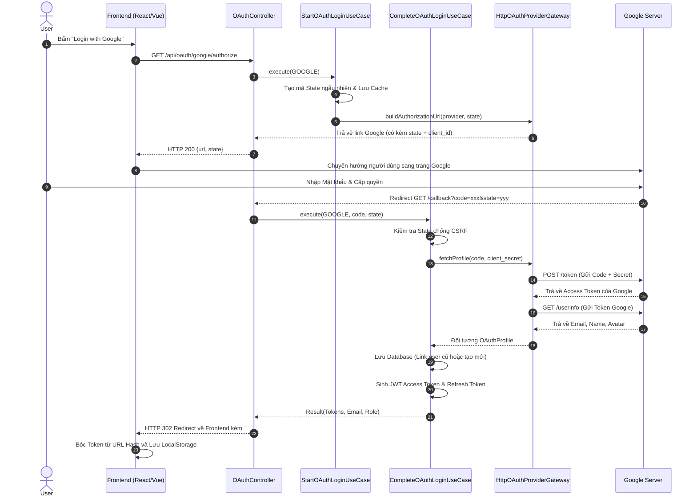

# Tài liệu Phân tích luồng xác thực OAuth2 (Google Login)

Luồng đăng nhập bằng Google trong dự án Cartzilla tuân thủ nghiêm ngặt chuẩn **OAuth2 Authorization Code Flow**. 

Đây là một quy trình khép kín, an toàn và được chia nhỏ vào các component khác nhau theo nguyên lý *Single Responsibility Principle (SRP)*. Dưới đây là phân tích chi tiết.

---

## 1. Sơ đồ Luồng dữ liệu (Sequence Diagram)

Sơ đồ dưới đây mô tả sự tương tác giữa Trình duyệt (Frontend), User Service (Backend) và Máy chủ Google.



---

## 2. Chi tiết Hiệp 1: Khởi tạo Luồng (Start Login)

Điểm bắt đầu là API `GET /api/oauth/{provider}/authorize` nằm trong `OAuthController`.

**Nhiệm vụ:**
1. Sinh ra một mã `state` ngẫu nhiên để chống tấn công **CSRF**.
2. Xây dựng đường link đăng nhập chuẩn của Google.

**Code tham chiếu (`HttpOAuthProviderGateway.java`):**
```java
public String buildAuthorizationUrl(OAuthProvider provider, String state) {
    // Lấy config từ file properties (application.yml)
    OAuthProviderProperties.Registration registration = registration(provider);
    
    return UriComponentsBuilder.fromUriString(registration.getAuthorizationUri())
            .queryParam("response_type", "code")
            .queryParam("client_id", registration.getClientId()) // Định danh ứng dụng Cartzilla
            .queryParam("redirect_uri", registration.getRedirectUri()) // Nơi Google sẽ gọi về
            .queryParam("state", state) // Bùa chú chống CSRF
            .queryParam("scope", registration.getScope())
            .build().toUriString();
}
```

---

## 3. Chi tiết Hiệp 2: Hứng kết quả và Hoàn tất (Complete Login)

Sau khi người dùng cấp quyền, Google sẽ gọi về endpoint: `GET /api/oauth/{provider}/callback?code=...&state=...`.

Đây là lúc `CompleteOAuthLoginUseCase.java` tỏa sáng với 3 bước bảo mật lõi:

### Bước 3.1: Đổi Code lấy Profile (Thông qua RestClient)
Hệ thống không thể tin tưởng `code` khơi khơi, nó phải cầm `code` kết hợp với `client_secret` để gọi lén lên Google.

```java
// Trong HttpOAuthProviderGateway.java
private Map<?, ?> exchangeCodeForToken(OAuthProviderProperties.Registration registration, String code) {
    LinkedMultiValueMap<String, String> form = new LinkedMultiValueMap<>();
    form.add("grant_type", "authorization_code");
    form.add("code", code);
    form.add("client_id", registration.getClientId());
    form.add("client_secret", registration.getClientSecret()); // Khóa bí mật chỉ Backend mới có
    
    return restClientBuilder.build().post()
            .uri(registration.getTokenUri())
            .body(form)
            .retrieve()
            .body(Map.class);
}
```

### Bước 3.2: Xử lý Database (Liên kết tài khoản)
Dự án được thiết kế rất thông minh để tự động nhận diện người dùng:
```java
// Trong CompleteOAuthLoginUseCase.java
private User findOrCreateUser(OAuthProvider provider, OAuthProfile profile) {
    return userRepository.findByEmail(profile.email())
            .map(existing -> {
                // Nếu Email đã tồn tại, kiểm tra xem nó bị ban chưa
                existing.requireActive(); 
                return existing;
            })
            .orElseGet(() -> 
                // Nếu chưa từng có, tự động tạo tài khoản mới (CUSTOMER)
                userRepository.save(User.createOAuthUser(
                    profile.email(), profile.displayName(), Role.CUSTOMER))
            );
}
```

### Bước 3.3: Trả Token về Frontend một cách bảo mật
Đây là điểm nhấn công nghệ của dự án. Thay vì trả về JSON (dễ bị lỗi nếu đang thao tác chuyển hướng trình duyệt) hoặc nhét vào Query String `?token=...` (dễ bị lộ trong Access Log của Nginx), hệ thống sử dụng **URL Fragment Hash `#`**.

```java
// Trong OAuthController.java
if (isBrowser) {
    // SECURITY: Đưa token vào URL fragment (#) thay vì query (?)
    // Fragment KHÔNG được gửi lên mạng, chỉ tồn tại trên RAM máy khách
    String fragment = "accessToken=" + enc(result.accessToken())
            + "&refreshToken=" + enc(result.refreshToken());
            
    // Bắn lệnh 302 FOUND ép trình duyệt quay về web React/Vue
    return ResponseEntity.status(HttpStatus.FOUND)
            .header("Location", frontendUrl + "/oauth/callback#" + fragment)
            .build();
}
```

---

## 4. Tổng kết Kiến trúc
*   **Decoupled (Độc lập):** Logic giao tiếp HTTP với Google nằm gọn trong `HttpOAuthProviderGateway`. Nếu mai sau muốn tích hợp Facebook/Github, hàm UseCase không cần phải sửa một dòng nào.
*   **Security First:** Áp dụng đủ các kỹ thuật bảo vệ: Chống CSRF (State), Tránh lộ lọt Log (Fragment Hash), Kiểm tra Email Verify của Google (`profile.emailVerified()`).
*   **User Experience (UX):** Trải nghiệm người dùng xuyên suốt không độ trễ, tự động liên kết tài khoản cũ (Auto-link) giúp tránh rác dữ liệu trong Database.
